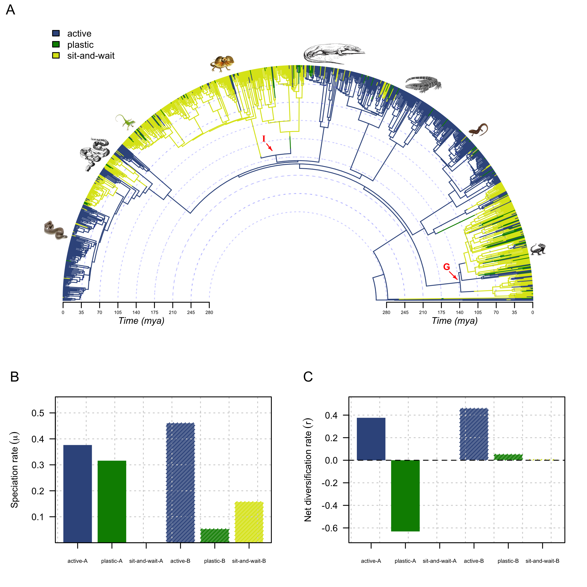

```{r, include = FALSE}

knitr::opts_chunk$set(comment = ">", fig.width = 7, fig.height = 7, dpi = 300, warning = FALSE, message = FALSE)

```

<br>

```{r}

##  Libraries

library(AICcmodavg)
library(ape)
library(BAMMtools)
library(bayou)
library(caper)
library(car)
library(corHMM)
library(cowplot)
library(diversitree)
library(geiger)
library(ggplotify)
library(grid)
library(hisse)
library(lattice)
library(latticeExtra)
library(MuMIn)
library(nlme)
library(patchwork)
library(plotrix)
library(png)
library(phytools)
library(raster)
library(reshape)
library(rsconnect)
library(scales)
library(shape)
library(TreeSim)
library(vioplot)
library(viridis)

## Create the manifest.json file for posit connect

rsconnect::writeManifest()


## Session info and R version

sessionInfo()
R.version

## setting seed for reproducibility

##set.seed(3487593)

##  Loading the data

raw.data <- read.csv('data/data_Meiri-2024.csv', as.is = TRUE)
str(raw.data)


range.data <- read.csv('data/area-of-lizard-ranges2.csv')
str(range.data)
colnames(range.data)[7] <- "area"
area <- range.data[c(1, 7)]

lizard.tree <- read.tree('data/zheng-wiens2016-tree.tre')

## Checking out the variables

unique(raw.data$Foraging.mode)

raw.data$Foraging.mode[raw.data$Foraging.mode == 'ACT'] <- 'active'
raw.data$Foraging.mode[raw.data$Foraging.mode == 'AMB'] <- 'sit-and-wait'
raw.data$Foraging.mode[raw.data$Foraging.mode == 'Mixed'] <- 'plastic'


## Filtering the data

filt.data <- raw.data[!is.na(raw.data$Foraging.mode), ]
str(filt.data)
dim(filt.data)
unique(filt.data$Foraging.mode)

## How many species do we have within each
## foraging behavior category?

tapply(X = filt.data$Species,
       INDEX = list(filt.data$Foraging.mode),       length)


## How many species with data of body mass do we have
## within each foraging behavior category?

((bd.mass <- tapply(X = filt.data$Maximum.body.mass..g.,
                    INDEX = list(filt.data$Foraging.mode),
                    FUN = function(X) length(na.omit(X)))))


## How many species with data of Mean.Tb do we have
## within each foraging behavior category?

((mean.tb <- tapply(X = filt.data$Mean.Tb,
                    INDEX = list(filt.data$Foraging.mode),
                    FUN = function(X) length(na.omit(X)))))


## Merging data of lizard ranges

names(area)[1] <- 'Species'
merg.data <- merge(filt.data, area, by = 'Species')
str(merg.data)


## How many species with distribution range
##data do we have within each foraging behavior category?

((range.area <- tapply(X = merg.data$area,
                       INDEX = list(merg.data$Foraging.mode),
                       FUN = function(X) length(na.omit(X)))))


## Visualizing the data

vis.data <- rbind(bd.mass, mean.tb, range.area)
colnames(vis.data) <- c('Active (n = 1136)',
                        'Plastic (n = 104)',
                        'Sit-and-wait (n = 566)')
rownames(vis.data) <- c('body mass', 'mean Tb', 'range area')


barplot(vis.data, beside = TRUE, ylim = c(0, 1500),
        las = 1, col = rep('white', 3), border = 'white',
        ylab = 'Absolut number', xlab = 'Foraging behavior')

par(new = TRUE)

grid()
barplot(vis.data, beside = TRUE, ylim = c(0, 1500),
        las = 1, add = TRUE)
box()

legend('topleft', legend = rownames(vis.data),
       fill = gray.colors(3), bty = 'n')


## Lineage through time plot

filt.data$Species <- gsub(' ', '_', as.character(filt.data$Species))
filt.data$Species[1:5]
rownames(filt.data) <- filt.data$Species

check <- name.check(lizard.tree, filt.data)
rm_phy <- check$tree_not_data
rm_dat <- check$data_not_tree
pruned.tree <- drop.tip(lizard.tree, rm_phy)

pruned.data <- subset(filt.data,
                      subset = rownames(filt.data) %in% pruned.tree$tip,
                      select = names(filt.data))
name.check(pruned.tree, pruned.data)

pruned.data$Foraging.mode <- as.factor(pruned.data$Foraging.mode)

map.spp <- as.matrix(pruned.data)[ , 12]
head(map.spp)

```


```{r, eval = FALSE}

## now let's do our stochastic mapping

lizard.maps.ard <- make.simmap(pruned.tree, map.spp, model = "ARD",
                               nsim = 5, pi = 'estimated', Q = 'mcmc')
lizard.maps.sym <- make.simmap(pruned.tree, pi = 'estimated',
                               map.spp, Q = 'mcmc', model = "SYM",
                               nsim = 5)
lizard.maps.er <- make.simmap(pruned.tree, map.spp, pi = 'estimated',
                              Q = 'mcmc', model = "ER",
                              nsim = 5)

## model selection based on AIC

data.frame(Model = c("modER", "modARD", "modSYM"),
           AIC = c(AIC(lizard.maps.er), AIC(lizard.maps.ard),
                   AIC(lizard.maps.sym)), stringsAsFactors = FALSE)

## increasing the simulations

lizard.maps.sym <- make.simmap(pruned.tree,
                               map.spp, model = "SYM", nsim = 100000)
save(lizard.maps.sym, file = "stochastic.map.sym.RData")


```

```{r,  include = FALSE}

load('data/stochastic.map.sym.RData')

```


```{r}

## convert to tree with unbranching nodes

idx <- sample(1:length(lizard.maps.sym), 1)
tt <- map.to.singleton(lizard.maps.sym[[idx]])

## compute all node heights

H <- nodeHeights(tt)

## pull out heights all all events

h <- max(H)-branching.times(tt)

## get the states at each event

ss <-setNames(as.factor(names(tt$edge.length)), tt$edge[ , 2])

## create a matrix to count lineages

lineages <- matrix(0, length(h), length(levels(as.factor(map.spp))),
                   dimnames = list(names(h), levels(as.factor(map.spp))))

## count them

for(i in 1:length(h)){
    ii <- intersect(which(h[i]>H[ , 1]), which(h[i]<=H[ , 2]))
    lineages[i,] <- summary(ss[ii])
}

## sort by event

ii <- order(h)
times <- h[ii]
lineages <- lineages[ii, ]


##png('./imgs/figure4.png', width = 7, height = 7, units = 'in',
##    res = 360)
##pdf('./imgs/figuer1.pdf')


layout(matrix(c(0, 0, 0, 0,
                1, 1, 2, 2,
                1, 1, 2, 2,
                0, 0, 0, 0), nrow = 4, ncol = 4, byrow = TRUE))


## create plot area

plot(NA, xlim = range(times), ylim = c(0, max(lineages)),
     ylab = "Lineages", bty = "n", las = 1,
     xlab = "Time (mya)", axes = FALSE)

## add lineages through time for each type

lines(times, lineages[ , 1], type = "s",
      lwd = 3, col = '#39568CFF')
lines(times, lineages[ , 2], type = "s",
      col = 'green4', lwd = 3)
lines(times, lineages[ , 3], type = "s",
      col = '#DCE319FF', lwd = 4)

## superimpose tree

cols <- setNames(make.transparent(c('#39568CFF', 'green4', '#DCE319FF'), 0.5),
                 levels(as.factor(map.spp)))

plot(lizard.maps.sym[[idx]], cols, ftype = "off", add = TRUE,
     lwd = 1, mar = c(5.1, 4.1, 4.1, 2.1))
obj<- markChanges(lizard.maps.sym[[idx]], plot = FALSE)

for(i in 1:nrow(obj)) lines(rep(obj[i,"x"] , 2), c(0, obj[i,"y"]),
                            lty = "dotted", col = make.transparent("grey", 0.8))

legend("topleft", levels(as.factor(map.spp)), pch = 22,
       pt.bg = c('#39568CFF', 'green4', '#DCE319FF'),
       pt.cex = 1.2 , cex = 0.8, bty = "n")

axis(1, at = round(seq(0, max(nodeHeights(lizard.maps.sym[[idx]])),
                       length.out = 4), 0),
     label = round(seq(max(nodeHeights(lizard.maps.sym[[idx]])), 0,
                       length.out = 4), 0), cex.axis = 0.8)
axis(2, las = 1, cex.axis = 0.8)
mtext('A', side = 2, at = 1200, las = 2, line = 3)


## create plot area

par(mgp = c(2.5, 1, 0))
plot(NA, xlim = range(times), ylim = c(0, max(log1p(lineages))),
     ylab = expression("Number of lineages"~(log[1+p])), bty = "n", las = 1,
     xlab = "Time (mya)", axes = FALSE)
grid()

## add lineages through time for each type

lines(times, log1p(lineages[ , 1]), type = "s",
      lwd = 3, col = '#39568CFF')
lines(times, log1p(lineages[ , 2]), type = "s",
      col = 'green4', lwd = 3)
lines(times, log1p(lineages[ , 3]), type = "s",
      col = '#DCE319FF', lwd = 4)

legend("topleft", levels(as.factor(map.spp)),
       pch = 22, pt.bg = c('#39568CFF', 'green4', '#DCE319FF'),
       pt.cex = 1.2 , cex = 0.8, bty = "n")

axis(1, at = round(seq(0, max(nodeHeights(lizard.maps.sym[[idx]])),
                       length.out = 4), 0),
     label = round(seq(max(nodeHeights(lizard.maps.sym[[idx]])), 0,
                       length.out = 4), 0), cex.axis = 0.8)
axis(2, las = 1, cex.axis = 0.8)
mtext('A', side = 2, at = 7.3, las = 2, line = 3)
box()

##dev.off()

```


```{r}

## setting up data for MuSEE model

## acording to Reptile database, there are
## currently 11989 species of squamates

((sampling.f <- as.numeric(tapply(X = pruned.data$Species,
                                  INDEX = list(pruned.data$Foraging.mode),
                                  length)/11989)))

pruned.data$Foraging.mode <- as.character(pruned.data$Foraging.mode)
pruned.data$Foraging.mode[pruned.data$Foraging.mode == 'active'] <- 3
pruned.data$Foraging.mode[pruned.data$Foraging.mode == 'plastic'] <- 2
pruned.data$Foraging.mode[pruned.data$Foraging.mode == 'sit-and-wait'] <- 1

pruned.data$Foraging.mode <- as.integer(pruned.data$Foraging.mode)
pruned.data <- pruned.data[pruned.tree$tip.label, ]
data.frame(tree = pruned.tree$tip.label[1:10],
           data = rownames(pruned.data)[1:10])
forg <- setNames(pruned.data$Foraging.mode, rownames(pruned.data))

```

```{r, eval = FALSE}


## writing down our MuSSE likelihood function

pruned.tree <- force.ultrametric(pruned.tree)
is.ultrametric(pruned.tree)

((lik.musse <- make.musse(pruned.tree,
                          forg, 3, sampling.f = sampling.f)))


p <- starting.point.musse(pruned.tree, k = 3)
p

obj <- birthdeath(pruned.tree)
bd(obj)

lik.null<-constrain(lik.musse,lambda2 ~ lambda1, lambda3 ~ lambda1, 
    mu2 ~ mu1, mu3 ~ mu1, q13 ~ 0, q21 ~ q12, q23 ~ q12, q31 ~ 0, 
    q32 ~ q12)
lik.null

## fitting a model - the “null” model in a sense - in which
## all birth & death rates are equal between states,
## the character evolution is ordered (that is 1<->2<->3),
## and there is a single character transition rate

p[argnames(lik.null)]

## fit the model
fit.null <- find.mle(lik.null, x.init = p[argnames(lik.null)])
fit.null

## most complex model in which all rates of speciation
## & extinction depend on the character state for our
## multi-state character

fit.full <- find.mle(lik.musse, x.init = p[argnames(lik.musse)])
fit.full

## model in which only the speciation rate (λ) varies between states

## create likelihood function

lik.lambda <- constrain(lik.musse, mu2 ~ mu1, mu3 ~ mu1,
                        q21 ~ q12, q23 ~ q12, q32 ~ q12)

## fit it

fit.lambda <- find.mle(lik.lambda, p[argnames(lik.lambda)])
fit.lambda

## model in which extinction rate (μ) varies

lik.mu <- constrain(lik.musse, lambda2 ~ lambda1, lambda3 ~ lambda1, 
    q13 ~ 0, q21 ~ q12, q23 ~ q12, q31 ~ 0, q32 ~ q12)
fit.mu <- find.mle(lik.mu, p[argnames(lik.mu)])
fit.mu

## a model in which λ & μ vary, but in which
## character transitions are ordered

lik.lambda.mu <- constrain(lik.musse, q13 ~ 0, q21 ~ q12, q23 ~ q12, 
    q31 ~ 0, q32 ~ q12)
fit.lambda.mu <- find.mle(lik.lambda.mu, p[argnames(lik.lambda.mu)])
fit.lambda.mu

## a model in which λ & μ are constant,
## but in which the transition process is
## full flexible (i.e., unordered)

lik.unordered <- constrain(lik.musse, lambda2 ~ lambda1,
                           lambda3 ~ lambda1, mu2 ~ mu1, mu3 ~ mu1)
fit.unordered <- find.mle(lik.unordered, p[argnames(lik.unordered)])
fit.unordered

## comparing our fitted models

AnovaResults <- anova(fit.null, 
    all.different = fit.full, 
    free.lambda = fit.lambda, 
    free.mu = fit.mu, 
    free.lambda.mu = fit.lambda.mu, 
    free.q = fit.unordered)
save(AnovaResults, file = 'anova-models.RData')
aicw(setNames(AnovaResults$AIC,rownames(AnovaResults)))

coef(fit.full)


## Bayesian mcmc to get posterior probability distributions

prior <- make.prior.exponential(1/2)

## because of the type of MCMC used by diversitree,
## is to set a control parameter w. This parameter
## affects how many function evaluations are required
## between updates to the MCMC chain; however we need
## to do some preliminary sampling from the posterior
## distribution to set it

prelim <- mcmc(lik.musse, fit.full$par, nsteps = 100,
               prior = prior, w = 1, print.every = 0)
head(prelim)

## Fitzjohn recommends setting w

w <- diff(sapply(prelim[2:(ncol(prelim)-1)],
                 quantile, c(0.05, 0.95)))
w

## running the mcmc

mcmc.fit.full <- mcmc(lik.musse, p[colnames(w)],
                      nsteps = 1e5, prior = prior,
                      w = w, print.every = 1000)
save(mcmc.fit.full, file = "mcmc.fit.full.RData")

```

```{r, include = FALSE}

load('data/mcmc.fit.full-10e5(2).RData')


##files <- list.files('results/', full.names = TRUE)

##mcmc.full <- data.frame()
##for(i in files){
##    load(i)
##    subset <- mcmc.fit.full
##    mcmc.full <- rbind(mcmc.full, subset)
##}

##dim(mcmc.full)


```


```{r, eval = FALSE}


pruned.tree <- force.ultrametric(pruned.tree)
is.ultrametric(pruned.tree)

## set up MuHISSE model
## multiHiSSE allows multiple states (0, 1, ..., N) and hidden states (A, B, ...)
## For 3 states (0,1,2) and 2 hidden states (A,B), the states are:
## 0A, 1A, 2A, 0B, 1B, 2B

pruned.data$Foraging.mode <- as.character(pruned.data$Foraging.mode)
pruned.data$Foraging.mode[pruned.data$Foraging.mode == 'active'] <- 0
pruned.data$Foraging.mode[pruned.data$Foraging.mode == 'plastic'] <- 1
pruned.data$Foraging.mode[pruned.data$Foraging.mode == 'sit-and-wait'] <- 2

# recode into two binary columns
pruned.data$Char1 <- ifelse(pruned.data$Foraging.mode == 2, 1, 0)
pruned.data$Char2 <- ifelse(pruned.data$Foraging.mode == 1, 1, 0)

# 3. Format exactly for MuHiSSE
# MuHiSSE requires: Column 1 = Taxa, Column 2 = Character 1, Column 3 = Character 2

muhisse_data <- pruned.data[ , c("Species", "Char1", "Char2")]
#head(muhisse_data)

## create a transition matrix for 3 states and 2 hidden states
## this creates a "full" model where all transitions are possible.

trans.rates <- TransMatMakerMuHiSSE(hidden.traits = 1)

# 2. Drop the unused '11' state combinations (State 4 and State 8 in the full matrix)
# This removes state 11A and 11B from your analysis
# Generate and filter the transition matrix
trans.rates <- ParDrop(trans.rates, c(4, 8))

# View the final matrix to ensure 11A and 11B are isolated

print(trans.rates)

# Define Turnover (speciation + extinction) and Extinction Fraction (extinction/speciation)
# Let's assume 2 hidden states, so we have 2 sets of rates (A and B).
# For a 3-state model, this means we map 6 total possible states (0A, 1A, 2A, 0B, 1B, 2B)
# to fewer parameters.
# In this example, we test if turnover differs between states 0,1,2 within
# the hidden categories.

# TURNOVER VECTOR setup (Net turnover = Speciation + Extinction)
# Format corresponds to: (00A, 01A, 10A, 11A, 00B, 01B, 10B, 11B)
# Assign '0' to positions 4 and 8 to drop state 11

turnover <- c(1, 2, 3, 0, 4, 5, 6, 0)

# EXTINCTION FRACTION VECTOR setup (Eps = Extinction / Speciation)
# We can estimate distinct extinction fractions or constrain them to be equal.
# Let's use the same parameter layout, dropping positions 4 and 8.

eps <- c(1, 2, 3, 0, 4, 5, 6, 0)

# SAMPLING FRACTIONS (f)
# Relative global proportion of species sampled per state combination.
# If you have complete sampling, set valid states to 1 and dropped states to 0.

f <- c(as.numeric(tapply(X = pruned.data$Species,
                                  INDEX = list(pruned.data$Foraging.mode),
                         length)/11989), 0)

muhisse_data <- muhisse_data[pruned.tree$tip.label, ]
data.frame(tree = pruned.tree$tip.label[1:10],
           data = rownames(muhisse_data)[1:10])

# Run the model 
# Ensure your tree tips exactly match the 'Species' column in your data frame

fit_3state_muhisse <- MuHiSSE(
  phy = pruned.tree, 
  data = muhisse_data, 
  f = f, 
  turnover = turnover, 
  eps = eps, 
  hidden.states = TRUE, 
  trans.rate = trans.rates
)

```


```{r, include = FALSE, eval = FALSE}

load("data/fit_3state_muhisse.RData")


# Review Results
# Check parameter estimates and overall model fit

print(fit_3state_muhisse)
print(fit_3state_muhisse$AICc)

#recon_muhisse <- MarginReconMuHiSSE(
#  phy = fit_3state_muhisse$phy, 
#  data = fit_3state_muhisse$data, 
#  f = fit_3state_muhisse$f, 
#  pars = fit_3state_muhisse$solution, 
#  hidden.states = 1,                 
#  condition.on.survival = TRUE,
#  n.cores = 4 # Adjust based on your available computer cores
#)

load("data/recon_muhisse.RData")

recon_muhisse$rates.mat

# 1. Extract the active net diversification rates directly from your screenshot's matrix
# (Filtering out the zeroed-out placeholder columns from C through H)

states <- c("(00A)", "(01A)", "(10A)", "(00B)", "(01B)", "(10B)")
model_div.rates   <- recon_muhisse$rates.mat["net.div", states]
model_spec   <- recon_muhisse$rates.mat["speciation", states]

# 2. Clean up labels for a publication-ready X-axis (removes parentheses)
clean_labels.div.rates <- gsub("[() ]", "", names(model_div.rates))
clean_labels.spec <- gsub("[() ]", "", names(model_spec))

```


```{r, eval = FALSE}


## likelihood profile showing how the
## likelihood changed through the MCMC run

plot(mcmc.fit.full$i, mcmc.fit.full$p, type = 'n',
     xlab = '', ylab = '', las = 1, axes = FALSE)
grid()

par(new = TRUE)
plot(mcmc.fit.full$i, mcmc.fit.full$p, type = 'l', xlab = 'Generation',
    ylab = 'log(L)', las = 1)


##png('./imgs/figure2.png', width = 7, height = 7, units = 'in',
##    res = 360)
##pdf('./imgs/figuer2.pdf')

## computing the mean of our posterior sample,
## and we can also compute things like the density
## or the 95% HPD interval, just as we would with
## any standard Bayesian MCMC

colMeans(mcmc.fit.full)[2:ncol(mcmc.fit.full)]

## speciation rates

colors <- setNames(c('#DCE319FF', 'green4', '#39568CFF'),
                   colnames(mcmc.fit.full[ , grep('lambda', colnames(mcmc.fit.full))]))

par(mar = c(7, 4, 1, 0.5), mgp = c(2.5, 1, 0))
plot(NA, ylim = c(0, 30), xlim = c(0, 0.5),
     axes = FALSE, ylab = '', xlab = '')
grid()
par(new = TRUE)
profiles.plot(mcmc.fit.full[ , grep('lambda', colnames(mcmc.fit.full))],
              col.line = colors, las = 1, legend.pos = NULL,
              lines.on.top = FALSE)
legend('topright', legend = c(expression(lambda[1]),
                              expression(lambda[2]), expression(lambda[3])),
       fil = colors, bty = 'n')

lambda <- as.data.frame(mcmc.fit.full[ , grep('lambda', colnames(mcmc.fit.full))])
str(lambda)

df_long <- reshape(data = lambda, direction = "long",
                   varying = c("lambda1", "lambda2", "lambda3"),
                   v.names = "lambda",
                   timevar = "foraging.mode",
                   times = c("sit and wait", "plastic", "active"))

rownames(df_long) <- 1:nrow(df_long)
df_long <- df_long[order(df_long$foraging.mode), ]
str(df_long)

colors <- setNames(c('#39568CFF', 'green4', '#DCE319FF'),
                   unique(df_long$foraging.mode))

vioplot(lambda ~ foraging.mode, data = df_long,
        border = NA, method = "jitter", side = "right",
        col = "white", las = 1, axes = FALSE,
        xaxt = 'n', yaxt = 'n', ylab = '', xlab = '')

grid(nx = NULL, ny = NULL,
     col = alpha("lightgray", 0.7), lwd = 1, lty = 2)

par(new = TRUE)

vioplot(lambda ~ foraging.mode, data = df_long,
        border = NA, method = "jitter", side = "right",
        col = colors, las = 1,
        xlab = "Foraging behavior",
        ylab = expression(Speciation~rates~(lambda)))

segments(x0 = 1,
         y0 = mean(df_long$lambda[df_long$foraging.mode == "active"]),
         x1 = 1.38,
         y1 = mean(df_long$lambda[df_long$foraging.mode == "active"]),
         lwd = 2, lty = 2, col = "black")
text(x = 1.45,
     y = mean(df_long$lambda[df_long$foraging.mode == "active"]),
     expression(mu))

segments(x0 = 2,
         y0 = mean(df_long$lambda[df_long$foraging.mode == "plastic"]),
         x1 = 2.39,
         y1 = mean(df_long$lambda[df_long$foraging.mode == "plastic"]),
         lwd = 2, lty = 2, col = "black")
text(x = 2.45,
     y = mean(df_long$lambda[df_long$foraging.mode == "plastic"]),
     expression(mu))

segments(x0 = 3,
         y0 = mean(df_long$lambda[df_long$foraging.mode == "sit and wait"]),
         x1 = 3.4,
         y1 = mean(df_long$lambda[df_long$foraging.mode == "sit and wait"]),
         lwd = 2, lty = 2, col = "black")
text(x = 3.45,
     y = mean(df_long$lambda[df_long$foraging.mode == "sit and wait"]),
     expression(mu))


## extinction rates

u <- as.data.frame(mcmc.fit.full[ , grep('mu', colnames(mcmc.fit.full))])
str(u)

df_long_mu <- reshape(data = u, direction = "long",
                   varying = c("mu1", "mu2", "mu3"),
                   v.names = "mu",
                   timevar = "foraging.mode",
                   times = c("sit and wait", "plastic", "active"))

rownames(df_long_mu) <- 1:nrow(df_long_mu)
df_long_mu <- df_long_mu[order(df_long_mu$foraging.mode), ]
str(df_long_mu)

vioplot(mu ~ foraging.mode, data = df_long_mu,
        border = NA, method = "jitter", side = "right",
        col = "white", las = 1, axes = FALSE,
        xaxt = 'n', yaxt = 'n', ylab = '', xlab = '')

grid(nx = NULL, ny = NULL,
     col = alpha("lightgray", 0.7), lwd = 1, lty = 2)

par(new = TRUE)

vioplot(mu ~ foraging.mode, data = df_long_mu,
        border = NA, method = "jitter", side = "right",
        col = colors, las = 1,
        xlab = "Foraging behavior",
        ylab = expression(Extinction~rates~(mu)))

segments(x0 = 1,
         y0 = mean(df_long$mu[df_long$foraging.mode == "active"]),
         x1 = 1.38,
         y1 = mean(df_long$mu[df_long$foraging.mode == "active"]),
         lwd = 2, lty = 2, col = "black")
text(x = 1.45,
     y = mean(df_long$mu[df_long$foraging.mode == "active"]),
     expression(mu))

segments(x0 = 2,
         y0 = mean(df_long$mu[df_long$foraging.mode == "plastic"]),
         x1 = 2.39,
         y1 = mean(df_long$mu[df_long$foraging.mode == "plastic"]),
         lwd = 2, lty = 2, col = "black")
text(x = 2.45,
     y = mean(df_long$mu[df_long$foraging.mode == "plastic"]),
     expression(mu))

segments(x0 = 3,
         y0 = mean(df_long$mu[df_long$foraging.mode == "sit and wait"]),
         x1 = 3.4,
         y1 = mean(df_long$mu[df_long$foraging.mode == "sit and wait"]),
         lwd = 2, lty = 2, col = "black")
text(x = 3.45,
     y = mean(df_long$mu[df_long$foraging.mode == "sit and wait"]),
     expression(mu))


## net diversification rates

net.div <- mcmc.fit.full[ , grep('lambda', colnames(mcmc.fit.full))]-
    mcmc.fit.full[ , grep('mu', colnames(mcmc.fit.full))]

net_long <- reshape(data = net.div, direction = "long",
                   varying = c("lambda1", "lambda2", "lambda3"),
                   v.names = "lambda",
                   timevar = "foraging.mode",
                   times = c("sit and wait", "plastic", "active"))

rownames(net_long) <- 1:nrow(net_long)
net_long <- net_long[order(net_long$foraging.mode), ]
str(net_long)


vioplot(lambda ~ foraging.mode, data = net_long,
        border = NA, method = "jitter", side = "right",
        col = "white", las = 1, axes = FALSE, ylim = c(-0.1, 0.2),
        xaxt = 'n', yaxt = 'n', ylab = '', xlab = '')

grid(nx = NULL, ny = NULL,
     col = alpha("lightgray", 0.7), lwd = 1, lty = 2)

par(new = TRUE)

vioplot(lambda ~ foraging.mode, data = net_long,
        border = NA, method = "jitter", side = "right",
        col = colors, las = 1, ylim = c(-0.1, 0.2),
        xlab = "Foraging behavior",
        ylab = expression(Net~diversification))

segments(x0 = 1,
         y0 = mean(net_long$lambda[net_long$foraging.mode == "active"]),
         x1 = 1.38,
         y1 = mean(net_long$lambda[net_long$foraging.mode == "active"]),
         lwd = 2, lty = 2, col = "black")
text(x = 1.45,
     y = mean(net_long$lambda[net_long$foraging.mode == "active"]),
     expression(mu))

segments(x0 = 2,
         y0 = mean(net_long$lambda[net_long$foraging.mode == "plastic"]),
         x1 = 2.39,
         y1 = mean(net_long$lambda[net_long$foraging.mode == "plastic"]),
         lwd = 2, lty = 2, col = "black")
text(x = 2.45,
     y = mean(net_long$lambda[net_long$foraging.mode == "plastic"]),
     expression(mu))

segments(x0 = 3,
         y0 = mean(net_long$lambda[net_long$foraging.mode == "sit and wait"]),
         x1 = 3.4,
         y1 = mean(net_long$lambda[net_long$foraging.mode == "sit and wait"]),
         lwd = 2, lty = 2, col = "black")
text(x = 3.45,
     y = mean(net_long$lambda[net_long$foraging.mode == "sit and wait"]),
     expression(mu))

## plotting arc phylogeny for visualization

##png('imgs/figure2_revised.png', width = 7, height = 7, units = 'in',
##    res = 360)
##pdf('./imgs/figuer1.pdf')


layout(matrix(c(1, 1, 1, 1, 1, 1,
                1, 1, 1, 1, 1, 1,
                1, 1, 1, 1, 1, 1,
                1, 1, 1, 1, 1, 1,
                1, 1, 1, 1, 1, 1,
                1, 1, 1, 1, 1, 1,
                2, 2, 2, 3, 3, 3,
                2, 2, 2, 3, 3, 3,
                2, 2, 2, 3, 3, 3), nrow = 9, ncol = 6, byrow = TRUE))


cols <- setNames(c('#39568CFF', 'green4', '#DCE319FF'),
                 levels(as.factor(map.spp)))

arc_height <- 0.5
h <- max(nodeHeights(pruned.tree))
plotSimmap(lizard.maps.sym[[1]], colors = cols,
           type = "arc", lwd = 1, ftype = "off",
           arc_height = 0.5, ylim = c(-0.1*h, 1.1*(1+arc_height)*h),
           mar = c(5, 4, 2, 3.2))

labs <- seq(0, h, by = 35)
draw.arc(0, 0, radius = h-labs[2:length(labs)]+0.5*h,
         angle1 = , angle2 = pi, col = make.transparent("blue",0.2),
         lty = "dotted")

axis(1, pos = -3.5, at = h-seq(0, h, by = 35)+0.5*h,
     labels = seq(0, h, by = 35), cex.axis = 0.5, padj = -2.5)
axis(1, pos = -3.5, at = -h+seq(0, h, by = 35)-0.5*h,
     labels = seq(0, h, by = 35), cex.axis = 0.5, padj = -2.5)
Arrows(290, 55, 302, 43, col = 'red', arr.length = 0.1)
text(285, 65, 'G', col = 'red', font = 2)
Arrows(-60, 300, -52, 290, col = 'red', arr.length = 0.1)
text(-65, 310, 'I', col = 'red', font = 2, family = 'Times New Roman')
text(-300, -40, "Time (mya)", font = 3)
text(300, -40, "Time (mya)", font = 3)

legend('topleft', levels(as.factor(map.spp)), bty = "n",
       fill = c('#39568CFF', 'green4', '#DCE319FF'))


## overlaying raster images

gek.img <-readPNG('imgs/gecko.png', native = TRUE)
rasterImage(gek.img, 445, 110, 475, 85)
sci.img <-readPNG('imgs/skink.png', native = TRUE)
rasterImage(sci.img, 325, 360, 365, 290)
tegu.img <-readPNG('imgs/tegu.png', native = TRUE)
rasterImage(tegu.img, 205, 375, 275, 450)
var.img <-readPNG('imgs/komodo.png', native = TRUE)
rasterImage(var.img, 10, 450, 130, 495)
igu.img <- readPNG('imgs/clamy.png', native = TRUE)
rasterImage(igu.img, -170, 470, -120, 435)
anole.img <- readPNG('imgs/anole.png', native = TRUE)
rasterImage(anole.img, -350, 360, -310, 320)
boa.img <- readPNG('imgs/boa.png', native = TRUE)
rasterImage(boa.img, -430, 220, -350, 320)
col.img <- readPNG('imgs/colubrid.png', native = TRUE)
rasterImage(col.img, -490, 90, -430, 180)


mtext('A', at = -550, side = 3, line = 0.5)

## plotting state transitions

##par(mar = c(4, 7, 1, 3), cex = 0.5, mgp = c(2.8, 1, 0),
##    las = 1, col.lab = 'white')

##for.density <- density(lizard.maps.sym)
##plot(for.density, ylim = c(0, 0.3),
##     transition = for.density$trans[1],
##     colors = '#39568CFF', xlab = 'Number of transitions',
##     ylab = 'Relative frequency', las = 1, axes = FALSE)
##plot(for.density, ylim = c(0, 0.2),
##     transition = for.density$trans[2],
##     colors = '#39568CFF', xlab = '', las = 1)
##plot(for.density, ylim = c(0, 0.2),
##     transition = for.density$trans[4],
##     colors = 'green4', xlab = '', las = 1) 
##plot(for.density, ylim = c(0, 0.2),
##     transition = for.density$trans[6],
##     colors = '#DCE319FF', xlab = '', las = 1) 
##plot(for.density, ylim = c(0, 0.2),
##     transition = for.density$trans[5],
##     colors = '#DCE319FF', xlab = '', las = 1) 
#plot(for.density, ylim = c(0, 0.2),
#     transition = for.density$trans[3],
#     colors = 'green4', xlab = '', las = 1) 


## Modifying axes labels

## plotting state transitions

##mtext('Relative frequency', at = -203, line = -4, las = 2)
##mtext('B', at = -203, line = 17, las = 1)
##mtext('Number of transitions', at = -45, line = -12.7, las = 1)


## Speciation

##par(mar = c(4, 6, 0, 1), mgp = c(2.5, 1, 0))

##vioplot(lambda ~ foraging.mode, data = df_long,
##        border = NA, method = "jitter", side = "right",
##        col = "white", las = 1, axes = FALSE,
##        xaxt = 'n', yaxt = 'n', ylab = '', xlab = '')

##grid(nx = NULL, ny = NULL,
##     col = alpha("lightgray", 0.7), lwd = 1, lty = 2)

##par(new = TRUE)

##vioplot(lambda ~ foraging.mode, data = df_long,
##        border = NA, method = "jitter", side = "right",
##        col = cols, las = 1,
##        xlab = "Foraging behavior",
##        ylab = expression(Speciation~rates~(lambda)))

##stripchart(lambda ~ foraging.mode, data = df_long, vertical = TRUE,
##           method = "jitter", add = TRUE, pch = 20,
##           col = alpha(cols, 0.1),
##           cex = 1.3)

##segments(x0 = 1,
##         y0 = mean(df_long$lambda[df_long$foraging.mode == "active"]),
##         x1 = 1.38,
##         y1 = mean(df_long$lambda[df_long$foraging.mode == "active"]),
##         lwd = 2, lty = 2, col = "black")
##text(x = 1.45,
##     y = mean(df_long$lambda[df_long$foraging.mode == "active"]),
##     expression(mu))

##segments(x0 = 2,
##         y0 = mean(df_long$lambda[df_long$foraging.mode == "plastic"]),
##         x1 = 2.39,
##         y1 = mean(df_long$lambda[df_long$foraging.mode == "plastic"]),
##         lwd = 2, lty = 2, col = "black")
##text(x = 2.45,
##     y = mean(df_long$lambda[df_long$foraging.mode == "plastic"]),
##     expression(mu))

##segments(x0 = 3,
##         y0 = mean(df_long$lambda[df_long$foraging.mode == "sit and wait"]),
##         x1 = 3.4,
##         y1 = mean(df_long$lambda[df_long$foraging.mode == "sit and wait"]),
##         lwd = 2, lty = 2, col = "black")
##text(x = 3.45,
##     y = mean(df_long$lambda[df_long$foraging.mode == "sit and wait"]),
##     expression(mu))


# 3. Create a clean, formal parameter plot using base R graphics

# Generate a barplot representing the exact maximum likelihood estimates

par(mar = c(4, 5, 0.5, 2))

mp <- barplot(
  model_spec,
  names.arg = clean_labels.spec,
  col = alpha(cols, 0.8),
  angle = 45,
  las = 2,
  ylab = "",
  xlab = "",
  ylim = c(min(model_spec), max(model_spec) + 0.1),
  axes = FALSE,
  xaxt = "n",
  border = FALSE
)

grid()
par(new = TRUE)

barplot(
  model_spec,
  names.arg = clean_labels.spec,
  col = cols,
  density = c(NA, NA, NA, 30, 30, 30), # Adds shading lines to visually distinguish Environment B
  angle = 45,
  las = 2,
  ylab = expression(paste("Speciation rate")~(mu)),
  xlab = "",
  ylim = c(min(model_spec), max(model_spec) + 0.1),
  xaxt = "n",
  border = FALSE
)

axis(1, at = mp, c("active-A", "plastic-A", "sit-and-wait-A",
                   "active-B", "plastic-B", "sit-and-wait-B"), cex.axis = 0.6)

box()

mtext('B', at = -1.5, line = 1.2, las = 1)


## Net diversification

##par(mar = c(4, 6, 0, 1), mgp = c(2.5, 1, 0))

##vioplot(lambda ~ foraging.mode, data = net_long,
##        border = NA, method = "jitter", side = "right",
##        col = "white", las = 1, axes = FALSE,
##        ylim = c(-0.1, 0.2),
##        xaxt = 'n', yaxt = 'n', ylab = '', xlab = '')

##grid(nx = NULL, ny = NULL,
##     col = alpha("lightgray", 0.7), lwd = 1, lty = 2)

##par(new = TRUE)

##vioplot(lambda ~ foraging.mode, data = net_long,
##        border = NA, method = "jitter", side = "right",
##        col = cols, las = 1,
##        xlab = "Foraging behavior",
##        ylim = c(-0.1, 0.2),
##        ylab = expression(Net~diversification))

##segments(x0 = 1,
##         y0 = mean(net_long$lambda[net_long$foraging.mode == "active"]),
##         x1 = 1.38,
##         y1 = mean(net_long$lambda[net_long$foraging.mode == "active"]),
##         lwd = 2, lty = 2, col = "black")
##text(x = 1.45,
##     y = mean(net_long$lambda[net_long$foraging.mode == "active"]),
##     expression(mu))

##segments(x0 = 2,
##         y0 = mean(net_long$lambda[net_long$foraging.mode == "plastic"]),
##         x1 = 2.39,
##         y1 = mean(net_long$lambda[net_long$foraging.mode == "plastic"]),
##         lwd = 2, lty = 2, col = "black")
##text(x = 2.45,
##     y = mean(net_long$lambda[net_long$foraging.mode == "plastic"]),
##     expression(mu))

##segments(x0 = 3,
##         y0 = mean(net_long$lambda[net_long$foraging.mode == "sit and wait"]),
##         x1 = 3.4,
##         y1 = mean(net_long$lambda[net_long$foraging.mode == "sit and wait"]),
##         lwd = 2, lty = 2, col = "black")
##text(x = 3.45,
##     y = mean(net_long$lambda[net_long$foraging.mode == "sit and wait"]),
##     expression(mu))

##mtext('C', at = -0.3, side = 3, line = 2)


# 3. Create a clean, formal parameter plot using base R graphics

# Generate a barplot representing the exact maximum likelihood estimates

par(mar = c(4, 5, 0.5, 2))

mp <- barplot(
  model_div.rates,
  names.arg = clean_labels.div.rates,
  col = alpha(cols, 0.8),
  angle = 45,
  las = 2,
  ylab = "",
  xlab = "",
  ylim = c(min(model_div.rates) - 0.1, max(model_div.rates) + 0.1),
  axes = FALSE,
  xaxt = "n",
  border = FALSE,
)

grid()
par(new = TRUE)

barplot(
  model_div.rates,
  names.arg = clean_labels.div.rates,
  col = cols,
  density = c(NA, NA, NA, 30, 30, 30), # Adds shading lines to visually distinguish Environment B
  angle = 45,
  las = 2,
  ylab = expression(paste("Net diversification rate")~(r)),
  xlab = "",
  ylim = c(min(model_div.rates) - 0.1, max(model_div.rates) + 0.1),
  xaxt = "n",
  border = FALSE
)

axis(1, at = mp, c("active-A", "plastic-A", "sit-and-wait-A",
                   "active-B", "plastic-B", "sit-and-wait-B"), cex.axis = 0.6)

box()

# Add a clean baseline line at y = 0
abline(h = 0, col = "black", lty = 2)

mtext('C', at = -1.5, line = 1.2, las = 1)

##dev.off()

## setting up the data for GLS models. We are using
## the merg.data table because it contains data on species ranges

```




```{r}

merg.data <- as.data.frame(merg.data)
merg.data$Species <- gsub(' ', '_', as.character(merg.data$Species))
rownames(merg.data) <- merg.data$Species
check <- name.check(lizard.tree, merg.data)
rm_phy <- check$tree_not_data
rm_dat <- check$data_not_tree
pruned.tree.mrg <- drop.tip(lizard.tree, rm_phy)

pruned.data.mrg <- subset(merg.data,
                          subset = rownames(merg.data) %in% pruned.tree.mrg$tip,
                          select = names(merg.data))
name.check(pruned.tree.mrg, pruned.data.mrg)

pruned.data.mrg$rep.output <- (pruned.data.mrg$Mean.number.of.offspring.per.litter.or.number.of.eggs.per.clutch)*(pruned.data.mrg$Number.of.litters.or.clutches.produced.per.year)

pruned.data.mrg$lifetime.rep.output <- (pruned.data.mrg$Mean.number.of.offspring.per.litter.or.number.of.eggs.per.clutch)*(pruned.data.mrg$Number.of.litters.or.clutches.produced.per.year)*(pruned.data.mrg$Maximum.Longevity..years.)

str(pruned.data.mrg)

```


```{r}

layout(matrix(c(0, 0, 0, 0,
                1, 1, 2, 2,
                1, 1, 2, 2,
                0, 0, 0, 0), nrow = 4,
              ncol = 4, byrow = TRUE))

hist(na.omit(pruned.data.mrg$Maximum.body.mass..g.),
     main = '', las = 1, border = 'white', col = 'white',
     axes = FALSE, xlab = '', ylab = '')
grid()
par(new = TRUE)
hist(na.omit(pruned.data.mrg$Maximum.body.mass..g.),
     main = '', las = 1, xlab = expression('Body mass'~(g)))
box()

hist(na.omit(log10(pruned.data.mrg$Maximum.body.mass..g.)+1),
     main = '', las = 1, border = 'white', col = 'white',
     axes = FALSE, xlab = '', ylab = '')
grid()
par(new = TRUE)
hist(na.omit(log10(pruned.data.mrg$Maximum.body.mass..g.)+1),
     main = '', las = 1, xlab = expression('Body mass'~log[10]+1~(g)))
box()

## transforming the data

pruned.data.mrg$Maximum.body.mass..g. <- log10(pruned.data.mrg$Maximum.body.mass..g.)+1


layout(matrix(c(0, 0, 0, 0,
                1, 1, 2, 2,
                1, 1, 2, 2,
                0, 0, 0, 0), nrow = 4,
              ncol = 4, byrow = TRUE))

hist(na.omit(pruned.data.mrg$Mean.Tb), main = '',
     las = 1, border = 'white', col = 'white',
     axes = FALSE, xlab = '', ylab = '')
grid()
par(new = TRUE)
hist(na.omit(pruned.data.mrg$Mean.Tb), main = '',
     las = 1, xlab = expression('Mean body temperature'~('\u00B0C')))
box()

hist(na.omit(log10(pruned.data.mrg$Mean.Tb)), main = '',
     las = 1, border = 'white', col = 'white',
     axes = FALSE, xlab = '', ylab = '')
grid()
par(new = TRUE)
hist(na.omit(log10(pruned.data.mrg$Mean.Tb)),
     main = '', las = 1,
     xlab = expression('Mean body temperature'~log[10]~('\u00B0C')))
box()


layout(matrix(c(0, 0, 0, 0,
                1, 1, 2, 2,
                1, 1, 2, 2,
                0, 0, 0, 0), nrow = 4,
              ncol = 4, byrow = TRUE))

hist(na.omit(pruned.data.mrg$area),
     main = '', las = 1, border = 'white',
     col = 'white', axes = FALSE, xlab = '', ylab = '')
grid()
par(new = TRUE)
hist(na.omit(pruned.data.mrg$area), main = '',
     las = 1, xlab = expression('Area of geographic range'~(km^2)))
box()

hist(na.omit(log10(pruned.data.mrg$area)),
     main = '', las = 1, border = 'white',
     col = 'white', axes = FALSE, xlab = '', ylab = '')
grid()
par(new = TRUE)
hist(na.omit(log10(pruned.data.mrg$area)),
     main = '', las = 1,
     xlab = expression('Area of geographic range'~log[10]~(km^2)))
box()

## transforming data

pruned.data.mrg$area <- log10(pruned.data.mrg$area)

layout(matrix(c(0, 0, 0, 0,
                1, 1, 2, 2,
                1, 1, 2, 2,
                0, 0, 0, 0), nrow = 4,
              ncol = 4, byrow = TRUE))

hist(na.omit(pruned.data.mrg$rep.output),
     main = '', las = 1, border = 'white',
     col = 'white', axes = FALSE, xlab = '', ylab = '')
grid()
par(new = TRUE)
hist(na.omit(pruned.data.mrg$rep.output),
     main = '', las = 1,
     xlab = expression('Annual reproductive output'))
box()

hist(na.omit(log10(pruned.data.mrg$rep.output)),
     main = '', las = 1, border = 'white', col = 'white',
     axes = FALSE, xlab = '', ylab = '')
grid()
par(new = TRUE)
hist(na.omit(log10(pruned.data.mrg$rep.output)),
     main = '', las = 1, xlab = expression('Annual reproductive output'))
box()

## transforming data

pruned.data.mrg$rep.output <- log10(pruned.data.mrg$rep.output)


layout(matrix(c(0, 0, 0, 0,
                1, 1, 2, 2,
                1, 1, 2, 2,
                0, 0, 0, 0), nrow = 4,
              ncol = 4, byrow = TRUE))

hist(na.omit(pruned.data.mrg$lifetime.rep.output),
     main = '', las = 1, border = 'white',
     col = 'white', axes = FALSE, xlab = '', ylab = '')
grid()
par(new = TRUE)
hist(na.omit(pruned.data.mrg$lifetime.rep.output),
     main = '', las = 1,
     xlab = expression('Lifetime reproductive output'))
box()

hist(na.omit(log10(pruned.data.mrg$lifetime.rep.output)),
     main = '', las = 1, border = 'white', col = 'white',
     axes = FALSE, xlab = '', ylab = '')
grid()
par(new = TRUE)
hist(na.omit(log10(pruned.data.mrg$lifetime.rep.output)),
     main = '', las = 1, xlab = expression('Lifetime reproductive output'))
box()

## transforming data

pruned.data.mrg$lifetime.rep.output <- log10(pruned.data.mrg$lifetime.rep.output)


names(pruned.data.mrg)[c(14, 26, 29, 30, 31)] <- c(expression('Maximum body mass'),
                                               expression('Mean body temperature'),
                                               expression('Area of geographic range'),
                                               'Annual reproductive \n output',
                                               'Lifetime reproductive \n output')


## looking at broad patterns in the data first

plot(pruned.data.mrg[c(14, 26, 29, 30, 31)], pch = 16, las = 1)

## fitting phylogenetic generalized least square models


tapply(X = pruned.data.mrg$'Maximum body mass',
       INDEX = list(pruned.data.mrg$Foraging.mode),
       FUN = function(X) length(na.omit(X)))

tapply(X = pruned.data.mrg$'Mean body temperature',
       INDEX = list(pruned.data.mrg$Foraging.mode),
       FUN = function(X) length(na.omit(X)))

tapply(X = pruned.data.mrg$'Area of geographic range',
       INDEX = list(pruned.data.mrg$Foraging.mode),
       FUN = function(X) length(na.omit(X)))

tapply(X = pruned.data.mrg$'Annual reproductive \n output',
       INDEX = list(pruned.data.mrg$Foraging.mode),
       FUN = function(X) length(na.omit(X)))

tapply(X = pruned.data.mrg$'Lifetime reproductive \n output',
       INDEX = list(pruned.data.mrg$Foraging.mode),
       FUN = function(X) length(na.omit(X)))


## filtering data by body mass and geographic range

mass.data <- pruned.data.mrg[!is.na(pruned.data.mrg$'Maximum body mass'), ]
range.data <- pruned.data.mrg[!is.na(pruned.data.mrg$'Area of geographic range'), ]

mass.range <- mass.data[mass.data$Species %in% range.data$Species, ]
rownames(mass.range) <- mass.range$Species


check <- name.check(lizard.tree, mass.range)
rm_phy <- check$tree_not_data
rm_dat <- check$data_not_tree
tree.mass.range <- drop.tip(lizard.tree, rm_phy)

pruned.mass.range <- subset(mass.range,
                            subset = rownames(mass.range) %in% tree.mass.range$tip,
                            select = names(mass.range))
name.check(tree.mass.range, pruned.mass.range)
colnames(pruned.mass.range)[14] <- "body.mass"
head(pruned.mass.range[c(12, 14, 29)])

```

```{r, eval = FALSE}

## looking at body size landscape before running PGLS

tree <- reorder(tree.mass.range, "postorder")
tree

## error assumed

MEvar <- 0.1

## data of body mass

dat <- setNames(pruned.mass.range$body.mass,
                rownames(pruned.mass.range))
dat <- dat + rnorm(length(dat), 0, sqrt(MEvar))

```

```{r, eval = FALSE}

## Defining prior. Prior for the maximum number
## of shifts was set as half of the number of branch lengths

priorOU <- make.prior(tree,
                      dists = list(dalpha ="dhalfcauchy",
                                   dsig2 = "dhalfcauchy",
                                   dk = "cdpois", dtheta = "dnorm"),
                      param = list(dalpha = list(scale = 0.1),
                                   dsig2 = list(scale = 0.1),
                                   dk = list(lambda = 10,
                                             kmax = length(tree$edge.length)/2),
                                   dsb = list(bmax = 1, prob = 1),
                                   dtheta = list(mean = mean(dat),
                                                 sd = 1.5*sd(dat))))

## to run our MCMC, we have to initiate
## the MCMC chain with some starting values

startpars <- priorSim(priorOU, tree, plot = TRUE)$pars[[1]]
priorOU(startpars)


## let's take what we have and put it into
## the function bayou.makeMCMC

mcmcOU <- bayou.makeMCMC(tree, dat, SE = MEvar, prior = priorOU,
    new.dir = TRUE, outname = "modelOU_r001", plot.freq = NULL)

## run the MCMC

mcmcOU$run(100000)

## the full MCMC results are written to a set of files.
## We can load them back in to R as follows

chainOU <- mcmcOU$load()
save(chainOU, file = 'mcmc_modelOU.RData')

## let's take a look at the results. We can set a "burnin"
## parameter that tells the package coda to discard the
## first bit of the chain

chainOU <- set.burnin(chainOU, 0.3)
##summary(chainOU)
##plot(chainOU, auto.layout = FALSE)

## let's visualize what we have so far. First, we will
## plot the truth, then 3 alternative ways of visualizing
## our chain

```

```{r, include = FALSE}

load('data/mcmc_modelOU-10e4.RData')

```

```{r, eval = FALSE}

## foraging tree

a <- pruned.mass.range$Species[pruned.mass.range$Foraging.mode == "active"]
p <- pruned.mass.range$Species[pruned.mass.range$Foraging.mode == "plastic"]
sw <- pruned.mass.range$Species[pruned.mass.range$Foraging.mode == "sit-and-wait"]


## paint the edges

bt <- paintBranches(tree.mass.range, edge =
                                         sapply(sw, match,
                                                tree.mass.range$tip.label),
                    state = "sit-and-wait", anc.state = "active")

bt <- paintBranches(bt, edge = sapply(p, match, bt$tip.label),
    state = "plastic", anc.state = "active")
bt

cols.bt <- setNames(c('#39568CFF', 'green4', '#DCE319FF'),
                    c('active', 'plastic', 'sit-and-wait'))


phenogram(bt, dat, ftype = 'off',
          fsize = 0.3,
          col = cols.bt,
          xlab = "Time (mya)",
          ylab = expression("Maximum body mass"~log[10]~(g)),
          axes = FALSE)
segments(x0 = -10, y0 = 3.8, x1 = 279,
         y1 = 3.8, lty = 2,
         col = alpha('black', 0.5))
axis(2, seq(0, max(pruned.mass.range$body.mass),
            by = 2),
     las = 1)
mtext(expression(body.mass~log[10]~(g)), side = 2, line = 2.5)
axis(1, at = round(seq(0, max(nodeHeights(bt)),
                       length.out = 4), 0),
     label = round(seq(max(nodeHeights(bt)), 0,
                       length.out = 4), 0), cex.axis = 0.8)
mtext('Time (mya)', side = 1, line = 3)
box()

legend("topleft", legend = names(cols.bt), pch = 21,
       pt.bg = cols.bt, pt.cex = 1, bty = "n",
       col = "transparent", cex = 0.8)


layout(matrix(c(1, 1, 2, 2,
                1, 1, 2, 2,
                1, 1, 2, 2,
                1, 1, 2, 2), nrow = 4,
              ncol = 4, byrow = TRUE))

par(las = 1, mar = c(0.2, 0.2, 0.5, 1))

plotSimmap.mcmc(chainOU, burnin = 0.3, pp.cutoff = 0.3,
                edge.type = 'regime', pal = viridis,
                cex = 0.2, show.tip.label = FALSE)
##nodelabels(cex = 0.3, bg = 'white')

legend('topleft', legend = 'regime', pch = 21,
       pt.bg = make.transparent('red', 0.2),
       col = 'black', bty = 'n', pt.cex = 2)

plot(bt, cols.bt, ftype = "off", lwd = 2, offset = 0.4,
     direction = "leftwards", mar = c(0.2, 0.2, 0.5, 1))

legend("topright", legend = names(cols.bt), pch = 21,
       pt.bg = cols.bt, pt.cex = 1.5, bty = "n",
       col = "transparent", cex = 1.5)


```

```{r, eval = FALSE}


## basic boxplot to look at body size among
## foraging behavior categories

par(mgp = c(2.5, 1, 0))

vioplot(pruned.mass.range$body.mass ~
            pruned.mass.range$Foraging.mode, border = NA,
        method = "jitter", side = "right", col = "white",
        las = 1, axes = FALSE, xaxt = 'n', yaxt = 'n',
        ylab = '', xlab = '')

grid(nx = NULL, ny = NULL, col = alpha("lightgray", 0.7),
     lwd = 1, lty = 2)

par(new = TRUE)

vioplot(pruned.mass.range$body.mass ~
            pruned.mass.range$Foraging.mode, border = NA,
        method = "jitter", side = "right",
        ylab = expression(paste("Maximum body mass")~log[10]~(g)),
        xlab = "Foraging behavior", col = alpha(cols.bt, 0.5), las = 1)

segments(x0 = 1,
         y0 = mean(pruned.mass.range$body.mass[pruned.mass.range$Foraging.mode == "active"]),
         x1 = 1.38,
         y1 = mean(pruned.mass.range$body.mass[pruned.mass.range$Foraging.mode == "active"]),
         lwd = 2, lty = 2, col = "black")
text(x = 1.45,
     y = mean(pruned.mass.range$body.mass[pruned.mass.range$Foraging.mode == "active"]),
     expression(mu))

segments(x0 = 2,
         y0 = mean(pruned.mass.range$body.mass[pruned.mass.range$Foraging.mode == "plastic"]),
         x1 = 2.39,
         y1 = mean(pruned.mass.range$body.mass[pruned.mass.range$Foraging.mode == "plastic"]),
         lwd = 2, lty = 2, col = "black")
text(x = 2.45,
     y = mean(pruned.mass.range$body.mass[pruned.mass.range$Foraging.mode == "plastic"]),
     expression(mu))

segments(x0 = 3,
         y0 = mean(pruned.mass.range$body.mass[pruned.mass.range$Foraging.mode == "sit-and-wait"]),
         x1 = 3.4,
         y1 = mean(pruned.mass.range$body.mass[pruned.mass.range$Foraging.mode == "sit-and-wait"]),
         lwd = 2, lty = 2, col = "black")
text(x = 3.45,
     y = mean(pruned.mass.range$body.mass[pruned.mass.range$Foraging.mode == "sit-and-wait"]),
     expression(mu))

```


```{r}

##names(pruned.mass.range)[14] <- 'body.mass'
pruned.mass.range$Species <- as.factor(pruned.mass.range$Species)
pruned.mass.range$Foraging.mode <- as.factor(pruned.mass.range$Foraging.mode)

bd.size.model <- gls(body.mass ~ Foraging.mode,
                     correlation =
                         corBrownian(phy = tree.mass.range,
                                     form = ~Species),
                     data = pruned.mass.range, method = "ML")
summary(bd.size.model)

```


```{r, eval = FALSE}


## Checking homogeneity of variance


layout(matrix(c(0, 0, 0, 0,
                1, 1, 2, 2,
                1, 1, 2, 2,
                0, 0, 0, 0), nrow = 4,
              ncol = 4, byrow = TRUE))

par(mgp = c(3, 1, 0))
plot(fitted(bd.size.model), resid(bd.size.model),
     col = "grey", pch = 20, las = 1, xaxt = 'n',
     yaxt = 'n', ylab = '', xlab = '')

grid()

par(new = TRUE)
plot(fitted(bd.size.model), resid(bd.size.model),
     col = "grey", pch = 20, xlab = "Fitted",
     ylab = "Residual", main = "Fitted versus Residuals",
     las = 1)

abline(h = 0, col = "darkorange", lwd = 2)


## Checking normality

qqnorm(resid(bd.size.model), col = "darkgrey",
       type = 'n', las = 1, main = '', xaxt = 'n',
       yaxt = 'n', xlab = '', ylab = '')

grid()

par(new = TRUE)
qqnorm(resid(bd.size.model), col = "darkgrey", las = 1)
qqline(resid(bd.size.model), col = "dodgerblue", lwd = 2)

```


```{r}

names(pruned.mass.range)[29] <- 'range'
range.model <- gls(range ~ Foraging.mode*body.mass,
                     correlation =
                         corBrownian(phy = tree.mass.range,
                                     form = ~Species),
                     data = pruned.mass.range, method = "ML")

range.model2 <- gls(range ~ Foraging.mode + body.mass,
                     correlation =
                         corBrownian(phy = tree.mass.range,
                                     form = ~Species),
                     data = pruned.mass.range, method = "ML")

range.model3 <- gls(range ~ Foraging.mode,
                     correlation =
                         corBrownian(phy = tree.mass.range,
                                     form = ~Species),
                     data = pruned.mass.range, method = "ML")

range.model4 <- gls(range ~ body.mass,
                     correlation =
                         corBrownian(phy = tree.mass.range,
                                     form = ~Species),
                    data = pruned.mass.range, method = "ML")


range.models <- anova(range.model, range.model2, range.model3, range.model4)

round(aicw(setNames(range.models$AIC,
              rownames(range.models))), 3)
summary(range.model)

```


```{r, eval = FALSE}

## Range corrected for body mass

names(pruned.mass.range)
pruned.mass.range$range_corr <- residuals(gls(range ~ body.mass,
                                              correlation = corBrownian(phy = tree.mass.range,
                                                                        form = ~Species),
                                              data = pruned.mass.range, method = "ML"))

range.model <- gls(range_corr ~ Foraging.mode,
                     correlation =
                         corBrownian(phy = tree.mass.range,
                                     form = ~Species),
                     data = pruned.mass.range, method = "ML")

summary(range.model)

```

```{r}

## plotting results of the model

##png('./imgs/figureS1.png', width = 7, height = 7, units = 'in',
##    res = 360)
##pdf('./imgs/figuerS1.pdf')


cols <- c('#39568CFF', 'green4', '#DCE319FF')

dim(pruned.mass.range)
pred.mod <- data.frame(body.mass = seq(min(pruned.mass.range$body.mass),
                                       max(pruned.mass.range$body.mass),
                                       len = 983),
                       Foraging.mode = pruned.mass.range$Foraging.mode,
                       row.names = rownames(pruned.mass.range))
pred.mod$range <- predict(range.model, pred.mod,
                          type = 'response', se = TRUE)$fit
pred.mod$se <- predict(range.model, pred.mod,
                       type = 'response', se = TRUE)$se.fit
head(pred.mod)

active <- pred.mod[pred.mod$Foraging.mode == 'active', ]
plastic <- pred.mod[pred.mod$Foraging.mode == 'plastic', ]
sit.and.wait <- pred.mod[pred.mod$Foraging.mode == 'sit-and-wait', ]

par(mgp = c(2.5, 1, 0))

plot(range ~ body.mass, data = pruned.mass.range,
     pch = 21, bg = cols[as.numeric(as.factor(pruned.mass.range$Foraging.mode))],
     las = 1, xaxt = 'n', yaxt = 'n', xlab = '', ylab = '',
     type = 'n', axes = FALSE)

grid(nx = NULL, ny = NULL, col = "lightgray", lwd = 1)
par(new = TRUE)

plot(range ~ body.mass, data = pruned.mass.range,
     pch = 21, bg = cols[as.numeric(as.factor(pruned.mass.range$Foraging.mode))],
     col = 'black', las = 1,
     xlab = expression("Maximum body mass"~log[10]~(g)),
     ylab = expression("Area of geographic range"~log[10]~(km^2)),
     type = 'p')

lines(active$range ~ active$body.mass,
      data = active, lwd = 2.5, col = '#39568CFF')

lines(plastic$range ~ plastic$body.mass,
      data = plastic, lwd = 2.5, col = 'green4')

lines(sit.and.wait$range ~ sit.and.wait$body.mass,
      data = sit.and.wait, lwd = 2.5, col = '#DCE319FF')

legend('bottomright',
       legend = c('active', 'plastic', 'sit-and-wait'),
       pch = 21, pt.bg = c('#39568CFF', 'green4', '#DCE319FF'),
       col = c('#39568CFF', 'green4', '#DCE319FF'), lwd = 1,
       bty = 'n', cex = 0.8)


##dev.off()


```


```{r}


## Checking homogeneity of variance


layout(matrix(c(0, 0, 0, 0,
                1, 1, 2, 2,
                1, 1, 2, 2,
                0, 0, 0, 0), nrow = 4,
              ncol = 4, byrow = TRUE))

par(mgp = c(3, 1, 0))
plot(fitted(range.model), resid(range.model),
     col = "grey", pch = 20, las = 1, xaxt = 'n',
     yaxt = 'n', ylab = '', xlab = '')

grid()

par(new = TRUE)
plot(fitted(range.model), resid(range.model),
     col = "grey", pch = 20, xlab = "Fitted",
     ylab = "Residual", main = "Fitted versus Residuals",
     las = 1)

abline(h = 0, col = "darkorange", lwd = 2)


## Checking normality

qqnorm(resid(range.model), col = "darkgrey",
       type = 'n', las = 1, main = '', xaxt = 'n',
       yaxt = 'n', xlab = '', ylab = '')

grid()

par(new = TRUE)
qqnorm(resid(range.model), col = "darkgrey", las = 1)
qqline(resid(range.model), col = "dodgerblue", lwd = 2)

```


```{r}

## setting up the data for modeling the reproductive output

rep.data <- pruned.data.mrg[!is.na(pruned.data.mrg$'Annual reproductive \n output'), ]


check <- name.check(lizard.tree, rep.data)
rm_phy <- check$tree_not_data
rm_dat <- check$data_not_tree
tree.rep <- drop.tip(lizard.tree, rm_phy)

data.rep.out <- subset(rep.data,
                      subset = rownames(rep.data) %in% tree.rep$tip,
                      select = names(rep.data))
name.check(tree.rep, data.rep.out)
names(data.rep.out)[30] <- 'repro.output'
names(data.rep.out)[14] <- 'body.mass'
names(data.rep.out)[29] <- 'range'
head(data.rep.out[ , c(12, 14, 29, 30)])

## fitting models

repro.model1 <- gls(repro.output ~ Foraging.mode*body.mass*range,
                     correlation =
                         corBrownian(phy = tree.rep,
                                     form = ~Species),
                     data = data.rep.out, method = "ML")


repro.model2 <- gls(repro.output ~ Foraging.mode*body.mass +
                        range,
                     correlation =
                         corBrownian(phy = tree.rep,
                                     form = ~Species),
                     data = data.rep.out, method = "ML")


repro.model3 <- gls(repro.output ~ Foraging.mode*range +
                        body.mass,
                     correlation =
                         corBrownian(phy = tree.rep,
                                     form = ~Species),
                     data = data.rep.out, method = "ML")

repro.model4 <- gls(repro.output ~ Foraging.mode + range +
                        body.mass,
                     correlation =
                         corBrownian(phy = tree.rep,
                                     form = ~Species),
                     data = data.rep.out, method = "ML")


repro.model5 <- gls(repro.output ~ Foraging.mode +
                        body.mass,
                     correlation =
                         corBrownian(phy = tree.rep,
                                     form = ~Species),
                     data = data.rep.out, method = "ML")

repro.model6 <- gls(repro.output ~ Foraging.mode +
                        range,
                     correlation =
                         corBrownian(phy = tree.rep,
                                     form = ~Species),
                     data = data.rep.out, method = "ML")

repro.model7 <- gls(repro.output ~ Foraging.mode,
                     correlation =
                         corBrownian(phy = tree.rep,
                                     form = ~Species),
                     data = data.rep.out, method = "ML")

repro.model8 <- gls(repro.output ~ range,
                     correlation =
                         corBrownian(phy = tree.rep,
                                     form = ~Species),
                     data = data.rep.out, method = "ML")

repro.model9 <- gls(repro.output ~ body.mass,
                     correlation =
                         corBrownian(phy = tree.rep,
                                     form = ~Species),
                     data = data.rep.out, method = "ML")


repro.models <- anova(repro.model1, repro.model2,
                      repro.model3, repro.model4,
                      repro.model5, repro.model6,
                      repro.model7, repro.model8,
                      repro.model9)

round(aicw(setNames(repro.models$AIC,
              rownames(repro.models))), 3)
summary(repro.model2)

```

```{r}

## plotting results of the model

cols <- c('#39568CFF', 'green4', '#DCE319FF')

dim(data.rep.out)
pred.mod <- data.frame(body.mass = seq(min(data.rep.out$body.mass),
                                       max(data.rep.out$body.mass), len = 290),
                       range = seq(min(data.rep.out$range), max(data.rep.out$range),
                                   len = 290), Foraging.mode = data.rep.out$Foraging.mode,
                       row.names = rownames(data.rep.out))
pred.mod$rep.out <- predict(repro.model2, pred.mod,
                            type = 'response', se = TRUE)$fit
pred.mod$se <- predict(repro.model2, pred.mod,
                       type = 'response', se = TRUE)$se.fit
head(pred.mod)

active <- pred.mod[pred.mod$Foraging.mode == 'active', ]
plastic <- pred.mod[pred.mod$Foraging.mode == 'plastic', ]
sit.and.wait <- pred.mod[pred.mod$Foraging.mode == 'sit-and-wait', ]

layout(matrix(c(0, 0, 0, 0,
                1, 1, 2, 2,
                1, 1, 2, 2,
                0, 0, 0, 0), nrow = 4,
              ncol = 4, byrow = TRUE))


##png('./imgs/figure3.png', width = 7, height = 7, units = 'in',
##    res = 360)
##pdf('./imgs/figuer3.pdf')


plot(repro.output ~ body.mass, data = data.rep.out,
     pch = 21,
     bg = cols[as.numeric(as.factor(data.rep.out$Foraging.mode))],
     las = 1, xaxt = 'n', yaxt = 'n', xlab = '', ylab = '',
     type = 'n', axes = FALSE)

grid(nx = NULL, ny = NULL, col = "lightgray", lwd = 1)
par(new = TRUE)

plot(repro.output ~ body.mass, data = data.rep.out,
     pch = 21,
     bg = cols[as.numeric(as.factor(data.rep.out$Foraging.mode))],
     col = 'black', las = 1, xlab = expression("Maximum body mass"~log[10]~(g)),
     ylab = expression(Log[10]~"clutch size"~x~"clutches per year"), type = 'p')

lines(active$rep.out ~ active$body.mass,
      data = active, lwd = 2.5, col = '#39568CFF')

lines(plastic$rep.out ~ plastic$body.mass,
      data = plastic, lwd = 2.5, col = 'green4')

lines(sit.and.wait$rep.out ~ sit.and.wait$body.mass,
      data = sit.and.wait, lwd = 2.5, col = '#DCE319FF')

legend('bottomright',
       legend = c('active', 'plastic',
                  'sit-and-wait'), pch = 21,
       pt.bg = c('#39568CFF', 'green4', '#DCE319FF'),
       col = c('#39568CFF', 'green4', '#DCE319FF'), lwd = 1,
       bty = 'n', cex = 0.8)
mtext('B', side = 2, at = 2.3, line = 2.5, las = 2)

##dev.off()


plot(repro.output ~ range, data = data.rep.out,
     pch = 21,
     bg = cols[as.numeric(as.factor(data.rep.out$Foraging.mode))],
     las = 1, xaxt = 'n',
     yaxt = 'n', xlab = '',
     ylab = '', type = 'n',
     axes = FALSE)

grid(nx = NULL, ny = NULL,
     col = "lightgray", lwd = 1)
par(new = TRUE)

plot(repro.output ~ range, data = data.rep.out,
     pch = 21, bg = cols[as.numeric(as.factor(data.rep.out$Foraging.mode))],
     col = 'black', las = 1,
     xlab = expression("Area of geographic range"~log[10]~(km^2)),
     ylab = expression(Log[10]~"clutch size"~x~"clutches per year"),
     type = 'p')

lines(active$rep.out ~ active$range,
      data = active,
      lwd = 2.5, col = '#39568CFF')

lines(plastic$rep.out ~ plastic$range,
      data = plastic,
      lwd = 2.5, col = 'green4')

lines(sit.and.wait$rep.out ~ sit.and.wait$range,
      data = sit.and.wait,
      lwd = 2.5, col = '#DCE319FF')

legend('topleft',
       legend = c('active', 'plastic',
                  'sit-and-wait'),
       pch = 21, pt.bg = c('#39568CFF',
                           'green4', '#DCE319FF'),
       col = c('#39568CFF',
               'green4', '#DCE319FF'),
       lwd = 1, bty = 'n', cex = 0.8)


```


```{r}


```{r}

## setting up the data for modeling the lifetime reproductive output

lifetime.rep.data <- pruned.data.mrg[!is.na(pruned.data.mrg$"Lifetime reproductive \n output"), ]


check <- name.check(lizard.tree, lifetime.rep.data)
rm_phy <- check$tree_not_data
rm_dat <- check$data_not_tree
tree.life.rep <- drop.tip(lizard.tree, rm_phy)

data.lifetime.rep.out <- subset(lifetime.rep.data,
                      subset = rownames(lifetime.rep.data) %in% tree.life.rep$tip,
                      select = names(lifetime.rep.data))
name.check(tree.life.rep, data.lifetime.rep.out)
names(data.lifetime.rep.out)[31] <- 'lifetime.repro.output'
names(data.lifetime.rep.out)[14] <- 'body.mass'
names(data.lifetime.rep.out)[29] <- 'range'
head(data.lifetime.rep.out[ , c(12, 14, 29, 31)])


data.lifetime.rep.out$corr.lifetime.repro.output <- residuals(lm(lifetime.repro.output ~ body.mass,
                                                                 data = data.lifetime.rep.out))
head(data.lifetime.rep.out[ , c(12, 14, 29, 31, 32)])


## fitting models

lifetime.repro.model1 <- gls(lifetime.repro.output ~ Foraging.mode*body.mass*range,
                     correlation =
                         corBrownian(phy = tree.life.rep,
                                     form = ~Species),
                     data = data.lifetime.rep.out, method = "ML")

lifetime.repro.model2 <- gls(lifetime.repro.output ~ Foraging.mode*body.mass + range,
                     correlation =
                         corBrownian(phy = tree.life.rep,
                                     form = ~Species),
                     data = data.lifetime.rep.out, method = "ML")

lifetime.repro.model3 <- gls(lifetime.repro.output ~ Foraging.mode*range + body.mass,
                     correlation =
                         corBrownian(phy = tree.life.rep,
                                     form = ~Species),
                     data = data.lifetime.rep.out, method = "ML")


lifetime.repro.model4 <- gls(lifetime.repro.output ~ Foraging.mode + range + body.mass,
                     correlation =
                         corBrownian(phy = tree.life.rep,
                                     form = ~Species),
                     data = data.lifetime.rep.out, method = "ML")

lifetime.repro.model5 <- gls(lifetime.repro.output ~ Foraging.mode + body.mass,
                     correlation =
                         corBrownian(phy = tree.life.rep,
                                     form = ~Species),
                     data = data.lifetime.rep.out, method = "ML")

lifetime.repro.model6 <- gls(lifetime.repro.output ~ Foraging.mode + range,
                     correlation =
                         corBrownian(phy = tree.life.rep,
                                     form = ~Species),
                     data = data.lifetime.rep.out, method = "ML")


lifetime.repro.models <- anova(lifetime.repro.model1, lifetime.repro.model2,
                               lifetime.repro.model3, lifetime.repro.model4,
                               lifetime.repro.model5, lifetime.repro.model6)

lifetime.repro.models

round(aicw(setNames(lifetime.repro.models$AIC,
              rownames(lifetime.repro.models))), 3)

summary(lifetime.repro.model2)


## fitting models with corrected lifetime reproductive output

corr.lifetime.repro.model1 <- gls(corr.lifetime.repro.output ~ Foraging.mode*range,
                     correlation =
                         corBrownian(phy = tree.life.rep,
                                     form = ~Species),
                     data = data.lifetime.rep.out, method = "ML")


corr.lifetime.repro.model2 <- gls(corr.lifetime.repro.output ~ Foraging.mode + range,
                     correlation =
                         corBrownian(phy = tree.life.rep,
                                     form = ~Species),
                     data = data.lifetime.rep.out, method = "ML")


corr.lifetime.repro.model3 <- gls(corr.lifetime.repro.output ~ Foraging.mode,
                     correlation =
                         corBrownian(phy = tree.life.rep,
                                     form = ~Species),
                     data = data.lifetime.rep.out, method = "ML")

corr.lifetime.repro.model4 <- gls(corr.lifetime.repro.output ~ range,
                     correlation =
                         corBrownian(phy = tree.life.rep,
                                     form = ~Species),
                     data = data.lifetime.rep.out, method = "ML")


corr.lifetime.repro.models <- anova(corr.lifetime.repro.model1, corr.lifetime.repro.model2,
                               corr.lifetime.repro.model3, corr.lifetime.repro.model4)
corr.lifetime.repro.models

round(aicw(setNames(corr.lifetime.repro.models$AIC,
              rownames(corr.lifetime.repro.models))), 3)

summary(corr.lifetime.repro.model2)
anova(corr.lifetime.repro.model2)

```

```{r, eval = FALSE}

## plotting results of the model

cols <- c('#39568CFF', 'green4', '#DCE319FF')

dim(data.lifetime.rep.out)
pred.mod <- data.frame(body.mass = seq(min(data.lifetime.rep.out$body.mass),
                                       max(data.lifetime.rep.out$body.mass), len = 284),
                       range = seq(min(data.lifetime.rep.out$range),
                                   max(data.lifetime.rep.out$range), len = 284),
                       Foraging.mode = data.lifetime.rep.out$Foraging.mode,
                       row.names = rownames(data.lifetime.rep.out))
pred.mod$lifetime.rep.out <- predict(lifetime.repro.model1, pred.mod,
                            type = 'response', se = TRUE)$fit
pred.mod$se <- predict(lifetime.repro.model1, pred.mod,
                       type = 'response', se = TRUE)$se.fit
head(pred.mod)

active <- pred.mod[pred.mod$Foraging.mode == 'active', ]
plastic <- pred.mod[pred.mod$Foraging.mode == 'plastic', ]
sit.and.wait <- pred.mod[pred.mod$Foraging.mode == 'sit-and-wait', ]


##png('./imgs/figure3.png', width = 7, height = 7, units = 'in',
##    res = 360)
##pdf('./imgs/figuer3.pdf')


plot(lifetime.repro.output ~ body.mass, data = data.lifetime.rep.out,
     pch = 21,
     bg = cols[as.numeric(as.factor(data.lifetime.rep.out$Foraging.mode))],
     las = 1, xaxt = 'n', yaxt = 'n', xlab = '', ylab = '',
     type = 'n', axes = FALSE)

grid(nx = NULL, ny = NULL, col = "lightgray", lwd = 1)
par(new = TRUE)

plot(lifetime.repro.output ~ body.mass, data = data.lifetime.rep.out,
     pch = 21,
     bg = cols[as.numeric(as.factor(data.lifetime.rep.out$Foraging.mode))],
     col = 'black', las = 1, xlab = expression("Maximum body mass"~log[10]~(g)),
     ylab = expression(Log[10]~"clutch size"~x~"clutches per year"~x~"longevity"),
     type = 'p')

lines(active$lifetime.rep.out ~ active$body.mass,
      data = active, lwd = 2.5, col = '#39568CFF')

lines(plastic$lifetime.rep.out ~ plastic$body.mass,
      data = plastic, lwd = 2.5, col = 'green4')

lines(sit.and.wait$lifetime.rep.out ~ sit.and.wait$body.mass,
      data = sit.and.wait, lwd = 2.5, col = '#DCE319FF')

legend('bottomright',
       legend = c('active', 'plastic',
                  'sit-and-wait'), pch = 21,
       pt.bg = c('#39568CFF', 'green4', '#DCE319FF'),
       col = c('#39568CFF', 'green4', '#DCE319FF'), lwd = 1,
       bty = 'n', cex = 0.8)
mtext('B', side = 2, at = 3.8, line = 3.2, las = 2)

##dev.off()

```


```{r}

## plotting results of the model of corrected lifetime reproductive output

cols <- c('#39568CFF', 'green4', '#DCE319FF')

dim(data.lifetime.rep.out)
pred.mod <- data.frame(range = seq(min(data.lifetime.rep.out$range),
                                   max(data.lifetime.rep.out$range), len = 284),
                       Foraging.mode = data.lifetime.rep.out$Foraging.mode,
                       row.names = rownames(data.lifetime.rep.out))
pred.mod$corr.lifetime.rep.out <- predict(corr.lifetime.repro.model2, pred.mod,
                            type = 'response', se = TRUE)$fit
pred.mod$se <- predict(corr.lifetime.repro.model2, pred.mod,
                       type = 'response', se = TRUE)$se.fit
head(pred.mod)

active <- pred.mod[pred.mod$Foraging.mode == 'active', ]
plastic <- pred.mod[pred.mod$Foraging.mode == 'plastic', ]
sit.and.wait <- pred.mod[pred.mod$Foraging.mode == 'sit-and-wait', ]


##png('./imgs/figure4_revised.png', width = 7, height = 7, units = 'in',
##    res = 360)
##pdf('./imgs/figuer3.pdf')


layout(matrix(c(0, 1, 1, 0,
                0, 1, 1, 0,
                0, 2, 2, 0,
                0, 2, 2, 0), nrow = 4, ncol = 4, byrow = TRUE))


##par(mar = c(4, 6.5, 0.5, 2))

plot(NA, xlim = range(times), ylim = c(0, max(log1p(lineages))),
     ylab = expression("Number of lineages"~(log[1+p])), bty = "n", las = 1,
     xlab = "Time (mya)", axes = FALSE, cex.lab = 1)
grid()

## add lineages through time for each type

lines(times, log1p(lineages[ , 1]), type = "s",
      lwd = 3, col = '#39568CFF')
lines(times, log1p(lineages[ , 2]), type = "s",
      col = 'green4', lwd = 3)
lines(times, log1p(lineages[ , 3]), type = "s",
      col = '#DCE319FF', lwd = 4)

legend("topleft", levels(as.factor(map.spp)),
       pch = 22, pt.bg = c('#39568CFF', 'green4', '#DCE319FF'),
       pt.cex = 1.2 , cex = .8, bty = "n")

axis(1, at = round(seq(0, max(nodeHeights(lizard.maps.sym[[idx]])),
                       length.out = 4), 0),
     label = round(seq(max(nodeHeights(lizard.maps.sym[[idx]])), 0,
                       length.out = 4), 0), cex.axis = 0.8, cex.lab = .9)
axis(2, las = 1, cex.axis = 0.7)
mtext('A', side = 2, at = 7, las = 2, line = 3.2)
box()


#cols.bt <- setNames(c('#39568CFF', 'green4', '#DCE319FF'),
#                    c('active', 'plastic', 'sit-and-wait'))

#par(cex.lab = .8)
#vioplot(corr.lifetime.repro.output ~ Foraging.mode, data = data.lifetime.rep.out,
#        border = NA,
#        method = "jitter", side = "right", col = "white",
#        las = 1, axes = FALSE, xaxt = 'n', yaxt = 'n',
#        ylab = '', xlab = '')

#grid(nx = NULL, ny = NULL, col = alpha("lightgray", 0.7),
#     lwd = 1, lty = 2)

#par(new = TRUE)

#vioplot(corr.lifetime.repro.output ~ Foraging.mode, data = data.lifetime.rep.out,
#        border = NA,
#        method = "jitter", side = "right",
#        ylab = "clutch size x clutches per year x longevity \n (log10)",
#        xlab = "Foraging behavior", col = alpha(cols.bt, 0.5), las = 1)

#segments(x0 = 1,
#         y0 = mean(pred.mod$corr.lifetime.rep.out[pred.mod$Foraging.mode == "active"]),
#         x1 = 1.38,
#         y1 = mean(pred.mod$corr.lifetime.rep.out[pred.mod$Foraging.mode == "active"]),
#         lwd = 2, lty = 2, col = "black")
#text(x = 1.45,
#     y = mean(pred.mod$corr.lifetime.rep.out[pred.mod$Foraging.mode == "active"]),
#     expression(mu))

#segments(x0 = 2,
#         y0 = mean(pred.mod$corr.lifetime.rep.out[pred.mod$Foraging.mode == "plastic"]),
#         x1 = 2.35,
#         y1 = mean(pred.mod$corr.lifetime.rep.out[pred.mod$Foraging.mode == "plastic"]),
#         lwd = 2, lty = 2, col = "black")
#text(x = 2.45,
#     y = mean(pred.mod$corr.lifetime.rep.out[pred.mod$Foraging.mode == "plastic"]),
#     expression(mu))

#segments(x0 = 3,
#         y0 = mean(pred.mod$corr.lifetime.rep.out[pred.mod$Foraging.mode == "sit-and-wait"]),
#         x1 = 3.3,
#         y1 = mean(pred.mod$corr.lifetime.rep.out[pred.mod$Foraging.mode == "sit-and-wait"]),
#         lwd = 2, lty = 2, col = "black")
#text(x = 3.45,
#     y = mean(pred.mod$corr.lifetime.rep.out[pred.mod$Foraging.mode == "sit-and-wait"]),
#     expression(mu))

#mtext('B', side = 2, at = 1.2, las = 2, line = 3.5)

par(mgp = c(2.3, 1, 0))

plot(corr.lifetime.repro.output ~ range, data = data.lifetime.rep.out,
     pch = 21,
     bg = cols[as.numeric(as.factor(data.lifetime.rep.out$Foraging.mode))],
     las = 1, xaxt = 'n', yaxt = 'n', xlab = '', ylab = '',
     type = 'n', axes = FALSE)

grid(nx = NULL, ny = NULL, col = "lightgray", lwd = 1)
par(new = TRUE)

plot(corr.lifetime.repro.output ~ range, data = data.lifetime.rep.out,
     pch = 21,
     bg = cols[as.numeric(as.factor(data.lifetime.rep.out$Foraging.mode))],
     col = 'black', las = 1, xlab = expression("Range area"~log[10]~(Km^2)),
     ylab = "clutch size x clutches per year x longevity \n (log10)",
     type = 'p', cex.axis = .9, cex.lab = 1)

lines(active$corr.lifetime.rep.out ~ active$range,
      data = active, lwd = 2.5, col = '#39568CFF')

lines(plastic$corr.lifetime.rep.out ~ plastic$range,
      data = plastic, lwd = 2.5, col = 'green4')

lines(sit.and.wait$corr.lifetime.rep.out ~ sit.and.wait$range,
      data = sit.and.wait, lwd = 2.5, col = '#DCE319FF')

legend('topleft',
       legend = c('active', 'plastic',
                  'sit-and-wait'), pch = 21,
       pt.bg = c('#39568CFF', 'green4', '#DCE319FF'),
       col = c('#39568CFF', 'green4', '#DCE319FF'), lwd = 1,
       bty = 'n', cex = 0.8)
mtext('B', side = 2, at = 1.3, line = 3.4, las = 2)

##dev.off()

```


```{r, eval = FALSE, include = FALSE}

## Checking homogeneity of variance


layout(matrix(c(0, 0, 0, 0,
                1, 1, 2, 2,
                1, 1, 2, 2,
                0, 0, 0, 0), nrow = 4,
              ncol = 4, byrow = TRUE))

par(mgp = c(3, 1, 0))
plot(fitted(repro.model2), resid(repro.model2),
     col = "grey", pch = 20, las = 1, xaxt = 'n',
     yaxt = 'n', ylab = '', xlab = '')

grid()

par(new = TRUE)
plot(fitted(repro.model2), resid(repro.model2),
     col = "grey", pch = 20, xlab = "Fitted",
     ylab = "Residual", main = "Fitted versus Residuals",
     las = 1)

abline(h = 0, col = "darkorange", lwd = 2)


## Checking normality

qqnorm(resid(repro.model2), col = "darkgrey",
       type = 'n', las = 1, main = '', xaxt = 'n',
       yaxt = 'n', xlab = '', ylab = '')

grid()

par(new = TRUE)
qqnorm(resid(repro.model2), col = "darkgrey", las = 1)
qqline(resid(repro.model2), col = "dodgerblue", lwd = 2)

```


```{r}

## setting up the data for modeling the body temperature

tb.data <- pruned.data.mrg[!is.na(pruned.data.mrg$'Mean body temperature') & !is.na(pruned.data.mrg$'Annual reproductive \n output'), ]

check <- name.check(lizard.tree, tb.data)
rm_phy <- check$tree_not_data
rm_dat <- check$data_not_tree
tree.tb <- drop.tip(lizard.tree, rm_phy)

data.tb <- subset(tb.data,
                      subset = rownames(tb.data) %in% tree.tb$tip,
                      select = names(tb.data))
name.check(tree.tb, data.tb)
names(data.tb)[30] <- 'repro.output'
names(data.tb)[14] <- 'body.mass'
names(data.tb)[26] <- 'mean.tb'
names(data.tb)[29] <- 'range'

head(data.tb[ , c(12, 14, 26, 29, 30)])
dim(data.tb[ , c(12, 14, 26, 29, 30)])

## fitting models

tb.model1 <- gls(mean.tb ~ Foraging.mode*body.mass*range*repro.output,
                     correlation =
                         corBrownian(phy = tree.tb,
                                     form = ~Species),
                     data = data.tb, method = "ML")

tb.model2 <- gls(mean.tb ~ Foraging.mode*body.mass + range +
                repro.output,
                     correlation =
                         corBrownian(phy = tree.tb,
                                     form = ~Species),
                     data = data.tb, method = "ML")

tb.model3 <- gls(mean.tb ~ Foraging.mode*range + body.mass +
                repro.output,
                     correlation =
                         corBrownian(phy = tree.tb,
                                     form = ~Species),
                     data = data.tb, method = "ML")

tb.model4 <- gls(mean.tb ~ Foraging.mode*repro.output + body.mass +
                range,
                     correlation =
                         corBrownian(phy = tree.tb,
                                     form = ~Species),
                     data = data.tb, method = "ML")

tb.model5 <- gls(mean.tb ~ Foraging.mode + repro.output + body.mass +
                range,
                     correlation =
                         corBrownian(phy = tree.tb,
                                     form = ~Species),
                     data = data.tb, method = "ML")

tb.model6 <- gls(mean.tb ~ Foraging.mode + repro.output + body.mass,
                     correlation =
                         corBrownian(phy = tree.tb,
                                     form = ~Species),
                     data = data.tb, method = "ML")

tb.model7 <- gls(mean.tb ~ Foraging.mode + repro.output + range,
                     correlation =
                         corBrownian(phy = tree.tb,
                                     form = ~Species),
                     data = data.tb, method = "ML")

tb.model8 <- gls(mean.tb ~ Foraging.mode + body.mass + range,
                     correlation =
                         corBrownian(phy = tree.tb,
                                     form = ~Species),
                     data = data.tb, method = "ML")

tb.model9 <- gls(mean.tb ~ Foraging.mode + range,
                     correlation =
                         corBrownian(phy = tree.tb,
                                     form = ~Species),
                     data = data.tb, method = "ML")

tb.model10 <- gls(mean.tb ~ Foraging.mode + repro.output,
                     correlation =
                         corBrownian(phy = tree.tb,
                                     form = ~Species),
                     data = data.tb, method = "ML")

tb.model11 <- gls(mean.tb ~ Foraging.mode + body.mass,
                     correlation =
                         corBrownian(phy = tree.tb,
                                     form = ~Species),
                     data = data.tb, method = "ML")

tb.model12 <- gls(mean.tb ~ Foraging.mode,
                     correlation =
                         corBrownian(phy = tree.tb,
                                     form = ~Species),
                     data = data.tb, method = "ML")

tb.model13 <- gls(mean.tb ~ body.mass,
                     correlation =
                         corBrownian(phy = tree.tb,
                                     form = ~Species),
                     data = data.tb, method = "ML")

tb.model14 <- gls(mean.tb ~ range,
                     correlation =
                         corBrownian(phy = tree.tb,
                                     form = ~Species),
                     data = data.tb, method = "ML")

tb.model15 <- gls(mean.tb ~ repro.output,
                     correlation =
                         corBrownian(phy = tree.tb,
                                     form = ~Species),
                     data = data.tb, method = "ML")


tb.models <- anova(tb.model1, tb.model2,
                   tb.model3, tb.model4,
                   tb.model5, tb.model6,
                   tb.model7, tb.model8,
                   tb.model9, tb.model10,
                   tb.model11, tb.model12,
                   tb.model13, tb.model14,
                   tb.model15)

round(aicw(setNames(tb.models$AIC,
              rownames(tb.models))), 3)
summary(tb.model14)

```

```{r}

## plotting results of the model

##png('./imgs/figure4.png', width = 7, height = 7, units = 'in',
##    res = 360)
##pdf('./imgs/figuer4.pdf')


cols <- c('#39568CFF', 'green4', '#DCE319FF')

dim(data.tb)
pred.mod <- data.frame(range = seq(min(data.tb$range),
                                   max(data.tb$range),
                                   len = 230),
                       Foraging.mode = data.tb$Foraging.mode,
                       row.names = rownames(data.tb))
pred.mod$mean.tb <- predict(tb.model14, pred.mod,
                            type = 'response', se = TRUE)$fit
pred.mod$se <- predict(tb.model14, pred.mod,
                       type = 'response', se = TRUE)$se.fit
head(pred.mod)

active <- pred.mod[pred.mod$Foraging.mode == 'active', ]
plastic <- pred.mod[pred.mod$Foraging.mode == 'plastic', ]
sit.and.wait <- pred.mod[pred.mod$Foraging.mode == 'sit-and-wait', ]


layout(matrix(c(0, 0, 0, 0,
                1, 1, 2, 2,
                1, 1, 2, 2,
                0, 0, 0, 0), nrow = 4, ncol = 4, byrow = TRUE))


par(mgp = c(2.5, 1, 0))

plot(mean.tb ~ range, data = data.tb,
     pch = 21,
     bg = cols[as.numeric(as.factor(data.tb$Foraging.mode))],
     las = 1, xaxt = 'n', yaxt = 'n', xlab = '', ylab = '',
     type = 'n', axes = FALSE)

grid(nx = NULL, ny = NULL, col = "lightgray", lwd = 1)
par(new = TRUE)

plot(mean.tb ~ range, data = data.tb,
     pch = 21,
     bg = cols[as.numeric(as.factor(data.tb$Foraging.mode))],
     col = 'black', las = 1, xlab = expression("Area of geographic range"~log[10]~(km^2)),
     ylab = expression("Mean body temperature"~('\u00B0C')), type = 'p')

lines(active$mean.tb ~ active$range,
      data = active, lwd = 2.5, col = '#39568CFF')

lines(plastic$mean.tb ~ plastic$range,
      data = plastic, lwd = 2.5, col = 'green4')

lines(sit.and.wait$mean.tb ~ sit.and.wait$range,
      data = sit.and.wait, lwd = 2.5, col = '#DCE319FF')

legend('bottomright',
       legend = c('active', 'plastic',
                  'sit-and-wait'), pch = 21,
       pt.bg = c('#39568CFF', 'green4', '#DCE319FF'),
       col = c('#39568CFF', 'green4', '#DCE319FF'), lwd = 1,
       bty = 'n', cex = 0.8)
mtext('A', side = 2, line = 2.7, at = 45, las = 2)


## Distribution of residuals

res.act <- density(residuals(tb.model14)[data.tb$Foraging.mode == "active"])
res.pla <- density(residuals(tb.model14)[data.tb$Foraging.mode == "plastic"])
res.sit <- density(residuals(tb.model14)[data.tb$Foraging.mode == "sit-and-wait"])

plot(NA, ylim = c(0, max(res.act$y)),
     xlim = c(min(res.pla$x), max(res.pla$x)),
     ann = FALSE, bty = "n", xaxt = "n",
     yaxt = "n", las = 1)
grid()

par(new = TRUE, mgp = c(3, 1, 0))
plot(res.act, ylim = c(0, max(res.act$y)),
     xlim = c(min(res.pla$x), max(res.pla$x)),
     xlab = 'Residuals',
     ylab = 'Density',
     type = 'n', main = '', las = 1)

polygon(res.act,
        col = alpha('#39568CFF', 0.3),
        border = FALSE)
polygon(res.pla,
        col = alpha('green4', 0.3),
        border = FALSE)
polygon(res.sit,
        col = alpha('#DCE319FF', 0.3),
        border = FALSE)

legend('topleft',
       legend = c('active', 'plastic',
                  'sit-and-wait'),
       fill = alpha(c('#39568CFF', 'green4',
                      '#DCE319FF'), 0.3),
       bty = 'n', cex = 0.8)
mtext('B', side = 2, line = 3.1, at = 0.127, las = 2)

##dev.off()

```


```{r}

## Checking homogeneity of variance

layout(matrix(c(0, 0, 0, 0,
                1, 1, 2, 2,
                1, 1, 2, 2,
                0, 0, 0, 0), nrow = 4,
              ncol = 4, byrow = TRUE))

par(mgp = c(3, 1, 0))
plot(fitted(tb.model14), resid(tb.model9),
     col = "grey", pch = 20, las = 1, xaxt = 'n',
     yaxt = 'n', ylab = '', xlab = '')

grid()

par(new = TRUE)
plot(fitted(tb.model14), resid(tb.model9),
     col = "grey", pch = 20, xlab = "Fitted",
     ylab = "Residual", main = "Fitted versus Residuals",
     las = 1)

abline(h = 0, col = "darkorange", lwd = 2)


## Checking normality

qqnorm(resid(tb.model14), col = "darkgrey",
       type = 'n', las = 1, main = '', xaxt = 'n',
       yaxt = 'n', xlab = '', ylab = '')

grid()

par(new = TRUE)
qqnorm(resid(tb.model14), col = "darkgrey", las = 1)
qqline(resid(tb.model14), col = "dodgerblue", lwd = 2)

```


```{r}


genomes <- read.delim("data/squamates-comparative-genomic-data.tsv",
                      sep = "\t")

names(genomes)
genome.annotation <- genomes[ , c(3, 12:14, 17:18, 21:22, 27:29)]

names(genome.annotation) <- c('species', 'genome.size', 'chr.number', 'assem.level', 'contig.N50',
                              'scaffold.N50',
                              'BUSCO.single.copy',
                              'BUSCO.duplicate',
                              'total.gene.number',
                              'protein.coding.genes',
                              'pseudogene.number')
head(genome.annotation)
genome.annotation$species <- gsub(' ', '_',
                                  genome.annotation$species)
genome.annotation$species[genome.annotation$species == "Crotalus_viridis_viridis"] <- "Crotalus_viridis"
genome.annotation$species[genome.annotation$species == "Elgaria_multicarinata_webbii"] <- "Elgaria_multicarinata"
genome.annotation$species[genome.annotation$species == "Coluber_constrictor_foxii"] <- "Coluber_constrictor"
genome.annotation$species[genome.annotation$species == "Diadophis_punctatus_similis"] <- "Diadophis_punctatus"
genome.annotation$species[genome.annotation$species == "Pituophis_catenifer_annectens"] <- "Pituophis_catenifer"
genome.annotation$species[genome.annotation$species == "Plestiodon_gilberti_rubricaudatus"] <- "Plestiodon_gilberti"
genome.annotation$species[genome.annotation$species == "Aspidoscelis_tigris_stejnegeri"] <- "Aspidoscelis_tigris"
genome.annotation$species[genome.annotation$species == "Varanus_salvator_macromaculatus"] <- "Varanus_salvator"
genome.annotation$species[genome.annotation$species == "Podarcis_muralis_nigriventris"] <- "Podarcis_muralis"
genome.annotation$species[genome.annotation$species == "Dibamus_cf._smithi"] <- "Dibamus_smithi"
genome.annotation$species[genome.annotation$species == "Thamnophis_sirtalis_fitchi"] <- "Thamnophis_sirtalis"
genome.annotation$species[genome.annotation$species == "Elgaria_multicarinata_webbii"] <- "Elgaria_multicarinata"
genome.annotation$species[genome.annotation$species == "Coluber_constrictor_foxii"] <- "Coluber_constrictor"
genome.annotation$species[genome.annotation$species == "Diadophis_punctatus_similis"] <- "Diadophis_punctatus"
genome.annotation$species[genome.annotation$species == "Pituophis_catenifer_annectens"] <- "Pituophis_catenifer"
genome.annotation$species[genome.annotation$species == "Pituophis_catenifer_pumilus"] <- "Pituophis_catenifer"
genome.annotation$species[genome.annotation$species == "Vipera_berus_berus"] <- "Vipera_berus"
genome.annotation$species[genome.annotation$species == "Plestiodon_gilberti_rubricaudatus"] <- "Plestiodon_gilberti"
genome.annotation$species[genome.annotation$species == "Aspidoscelis_tigris_stejnegeri"] <- "Aspidoscelis_tigris"
genome.annotation$species[genome.annotation$species == "Natrix_helvetica_helvetica"] <- "Natrix_helvetica"
genome.annotation$species[genome.annotation$species == "Anolis_sagrei_ordinatus"] <- "Anolis_sagrei"

geno.size <- aggregate(genome.annotation$genome.size, by = list(genome.annotation$species), mean)
names(geno.size) <- c('Species', 'genome.size')
rownames(geno.size) <- geno.size$Species

check <- name.check(lizard.tree, geno.size)
rm_phy <- check$tree_not_data
rm_dat <- check$data_not_tree
geno.size.tree <- drop.tip(lizard.tree, rm_phy)

pruned.geno.size.data <- subset(geno.size,
                      subset = rownames(geno.size) %in% geno.size.tree$tip,
                      select = names(geno.size))
name.check(geno.size.tree, pruned.geno.size.data)
str(pruned.geno.size.data)
geno.size.tree

pruned.geno.size.data <- merge(pruned.geno.size.data, pruned.data, by = 'Species')

tapply(X = pruned.geno.size.data$Species,
       INDEX = list(pruned.geno.size.data$Foraging.mode),
       FUN = function(X) length(na.omit(X)))

rownames(pruned.geno.size.data) <- pruned.geno.size.data$Species
names(pruned.geno.size.data)
names(pruned.geno.size.data)[15] <- 'max.body.mass'
pruned.geno.size.data$max.body.mass <- log10(pruned.geno.size.data$max.body.mass)+1
pruned.geno.size.data$genome.size <- log10(pruned.geno.size.data$genome.size)

pruned.geno.size.data$lifetime.rep.out <- (pruned.geno.size.data$Mean.number.of.offspring.per.litter.or.number.of.eggs.per.clutch)*(pruned.geno.size.data$Number.of.litters.or.clutches.produced.per.year)*(pruned.geno.size.data$"Maximum.Longevity..years.")

pruned.geno.size.data <- pruned.geno.size.data[!is.na(pruned.geno.size.data$lifetime.rep.out), ]
pruned.geno.size.data$lifetime.rep.out <- log10(pruned.geno.size.data$lifetime.rep.out)
pruned.geno.size.data$corr.lifetime.rep.out <- residuals(lm(pruned.geno.size.data$lifetime.rep.out ~ pruned.geno.size.data$max.body.mass))

head(pruned.geno.size.data[ , c(1:2, 13, 15, 30, 31)])

pruned.geno.size.data$Foraging.mode[pruned.geno.size.data$Foraging.mode == 1] <- "sit-and-wait"
pruned.geno.size.data$Foraging.mode[pruned.geno.size.data$Foraging.mode == 2] <- "plastic"
pruned.geno.size.data$Foraging.mode[pruned.geno.size.data$Foraging.mode == 3] <- "active"

tapply(pruned.geno.size.data$lifetime.rep.out,
       list(pruned.geno.size.data$Foraging.mode), length)

## Cost of carrying around excessive genetic machinery

cost.model1 <- gls(corr.lifetime.rep.out ~ Foraging.mode*genome.size,
                 correlation =
                         corBrownian(phy = geno.size.tree,
                                     form = ~Species),
                 data = pruned.geno.size.data, method = "ML")

cost.model2 <- gls(corr.lifetime.rep.out ~ Foraging.mode + genome.size,
                 correlation =
                         corBrownian(phy = geno.size.tree,
                                     form = ~Species),
                 data = pruned.geno.size.data, method = "ML")

cost.model3 <- gls(corr.lifetime.rep.out ~ Foraging.mode,
                 correlation =
                         corBrownian(phy = geno.size.tree,
                                     form = ~Species),
                 data = pruned.geno.size.data, method = "ML")


cost.model4 <- gls(corr.lifetime.rep.out ~ genome.size,
                 correlation =
                         corBrownian(phy = geno.size.tree,
                                     form = ~Species),
                     data = pruned.geno.size.data, method = "ML")


cost.models <- anova(cost.model1, cost.model2,
                     cost.model3, cost.model4)
cost.models


round(aicw(setNames(cost.models$AIC,
                    rownames(cost.models))), 3)


summary(cost.model3)


## Heterozygosity

He.data <- read.table("data/merged_He_data.txt", header = TRUE, sep = "")
str(He.data)

He.data$Foraging.mode[He.data$species == "Anolis_brevirostris"] <- "sit-and-wait"
He.data$Foraging.mode[He.data$species == "Anolis_fuscoauratus"] <- "sit-and-wait"
He.data$Foraging.mode[He.data$species == "Anolis_krugi"] <- "sit-and-wait"

He.data <- He.data[!He.data$species == "Cerastes_cerastes", ]
He.data <- He.data[!He.data$species == "Thamnophis_sirtalis", ]
He.data <- He.data[!He.data$species == "Arizona_elegans", ]
He.data <- He.data[!He.data$species == "Lampropeltis_getula", ]

He.data <- He.data[He.data$N_SITES >= 100, ]
He.data$N_HET <- He.data$N_SITES - He.data$O.HOM.
He.data$He <- He.data$N_HET/He.data$N_SITES

He.species <- aggregate(He.data[c(9, 4)],
                        list(He.data$Foraging.mode, He.data$species), mean)
colnames(He.species)[1:2] <- c("Foraging.mode", "species")
rownames(He.species) <- He.species$species
##He.species

## prunning the tree

check <- name.check(lizard.tree, He.species)
rm_phy <- check$tree_not_data
rm_dat <- check$data_not_tree
pruned.tree <- drop.tip(lizard.tree, rm_phy)

pruned.he <- subset(He.species,
                      subset = rownames(He.species) %in% pruned.tree$tip,
                      select = names(He.species))
name.check(pruned.tree, pruned.he)
He <- setNames(pruned.he$He, rownames(pruned.he))


active <- pruned.he$species[pruned.he$Foraging.mode == "active"]
plastic <- pruned.he$species[pruned.he$Foraging.mode == "plastic"]
sit.and.wait <- pruned.he$species[pruned.he$Foraging.mode == "sit-and-wait"]

## paint the edges

painted.tree1 <- paintBranches(pruned.tree, edge = sapply(sit.and.wait, match, pruned.tree$tip.label),
                              state = "sit-and-wait", anc.state = "active")
painted.tree2 <- paintBranches(painted.tree1, 
                               edge = sapply(plastic, match, painted.tree1$tip.label),
                               state = "plastic")
final.tree <- paintBranches(painted.tree2, 
                            edge = sapply(active, match, painted.tree2$tip.label),
                            state = "active")

## plotting results

dim(pruned.geno.size.data)
pred.mod <- data.frame(genome.size = seq(min(pruned.geno.size.data$genome.size),
                                       max(pruned.geno.size.data$genome.size),
                                       len = 57),
                       Foraging.mode = pruned.geno.size.data$Foraging.mode,
                       row.names = rownames(pruned.geno.size.data))

pred.mod$corr.lifetime.rep.out <- predict(cost.model3, pred.mod,
                          type = 'response', se = TRUE)$fit
pred.mod$se <- predict(cost.model3, pred.mod,
                       type = 'response', se = TRUE)$se.fit


head(pred.mod)

active <- pred.mod[pred.mod$Foraging.mode == 'active', ]
plastic <- pred.mod[pred.mod$Foraging.mode == 'plastic', ]
sit.and.wait <- pred.mod[pred.mod$Foraging.mode == 'sit-and-wait', ]


##png('./imgs/figure3_revised.png', width = 7, height = 7, units = 'in',
##    res = 360)
##pdf('./imgs/figuer3.pdf')


##layout(matrix(c(1, 1, 2, 2,
##                1, 1, 2, 2,
##                2, 2, 2, 2,
##                2, 2, 2, 2,
##                2, 2, 2, 2), ncol = 4, nrow = 5, byrow = TRUE))

##layout.show(n = 2)

##cols <- setNames(c("#39568CFF", "green4", "#DCE319FF"),
##                 c("active", "plastic", "sit-and-wait"))

##par(mar = c(4.5, 4, 0.5, 3), mgp = c(2.5, 1, 0))

##plot(corr.lifetime.rep.out ~ genome.size, data = pruned.geno.size.data,
##     pch = 21, bg = cols[as.numeric(as.factor(pruned.geno.size.data$Foraging.mode))],
##     las = 1, xaxt = 'n', yaxt = 'n', xlab = '', ylab = '',
##     type = 'n', axes = FALSE)

##grid(nx = NULL, ny = NULL, col = "lightgray", lwd = 1)
##par(new = TRUE)

##plot(corr.lifetime.rep.out ~ genome.size, data = pruned.geno.size.data,
##     pch = 21, bg = cols[as.numeric(as.factor(pruned.geno.size.data$Foraging.mode))],
##     col = 'black', las = 1,
##     xlab = expression("Genome size"~log[10]~(Mb)),
##     ylab = expression(Log[10]~"clutch size"~x~"clutches per year"~x~"longevity"),
##     type = 'p', cex.lab = 0.9)

##lines(active$corr.lifetime.rep.out ~ active$genome.size,
##      data = active, lwd = 2.5, col = '#39568CFF')

##lines(plastic$corr.lifetime.rep.out ~ plastic$genome.size,
##      data = plastic, lwd = 2.5, col = 'green4')

##lines(sit.and.wait$corr.lifetime.rep.out ~ sit.and.wait$genome.size,
##      data = sit.and.wait, lwd = 2.5, col = '#DCE319FF')

##legend('topleft',
##       legend = c('active', 'plastic', 'sit-and-wait'),
##       pch = 21, pt.bg = c('#39568CFF', 'green4', '#DCE319FF'),
##       col = c('#39568CFF', 'green4', '#DCE319FF'), lwd = 1,
##       bty = 'n', cex = 0.8)

##mtext('A', side = 2, at = 1.3, las = 2, line = 3.1)


## tree

##par(mar = c(5.1, 4.1, 4.1, 2.1), mgp = c(3, 1, 0))
##plot(final.tree, cols, fsize = 0.8, ftype = "i", lwd = 3, offset = 2.3, mar = c(2, 0, 2, 0))
##legend(x = 0, y = 0.5, legend = c("active", "plastic", "sit-and-wait"),
##       lwd = 2, bty = "n", col = cols, cex = 0.9, xpd = TRUE)

##par(new = TRUE)
##par(mar = c(2, 41.7, 2, 9.4))
##barplot(He[pruned.tree$tip.label], horiz = TRUE, width = 1, space = 0,
##        ylim = c(1, length(pruned.tree$tip.label))-0.5, names = "", las = 2,
##        cex.axis = 0.5, axes = FALSE)

##axis(1, at = seq(min(He), max(He), 0.07), labels = FALSE, line = -1)
##text(round(seq(min(He), max(He), 0.07), 2), par("usr")[3] + 0.7,
##     labels = round(seq(min(He), max(He), 0.07), 2), srt = 50, pos = 1,
##     xpd = TRUE, cex = 0.5, offset = 1)

##mtext("Heterozygosity (He)", side = 1, line = 0.5, cex = 0.5, font = 2)

##dev.off()

```


```{r, eval = FALSE}


par(mgp = c(2.5, 1, 0))

cols.bt <- setNames(c('#39568CFF', 'green4', '#DCE319FF'),
                    c('active', 'plastic', 'sit-and-wait'))

vioplot(pruned.geno.size.data$genome.size ~
            pruned.geno.size.data$Foraging.mode, border = NA,
        method = "jitter", side = "right", col = "white",
        las = 1, axes = FALSE, xaxt = 'n', yaxt = 'n',
        ylab = '', xlab = '')

grid(nx = NULL, ny = NULL, col = alpha("lightgray", 0.7),
     lwd = 1, lty = 2)

par(new = TRUE)

vioplot(pruned.geno.size.data$genome.size ~
            pruned.geno.size.data$Foraging.mode, border = NA,
        method = "jitter", side = "right",
        ylab = expression(paste("Genome size")~log[10]~(Mb)),
        xlab = "Foraging behavior", col = alpha(cols.bt, 0.5), las = 1)

segments(x0 = 1,
         y0 = mean(pruned.geno.size.data$genome.size[pruned.geno.size.data$Foraging.mode == "active"]),
         x1 = 1.38,
         y1 = mean(pruned.geno.size.data$genome.size[pruned.geno.size.data$Foraging.mode == "active"]),
         lwd = 2, lty = 2, col = "black")
text(x = 1.45,
     y = mean(pruned.geno.size.data$genome.size[pruned.geno.size.data$Foraging.mode == "active"]),
     expression(mu))

segments(x0 = 2,
         y0 = mean(pruned.geno.size.data$genome.size[pruned.geno.size.data$Foraging.mode == "plastic"]),
         x1 = 2.39,
         y1 = mean(pruned.geno.size.data$genome.size[pruned.geno.size.data$Foraging.mode == "plastic"]),
         lwd = 2, lty = 2, col = "black")
text(x = 2.45,
     y = mean(pruned.geno.size.data$genome.size[pruned.geno.size.data$Foraging.mode == "plastic"]),
     expression(mu))

segments(x0 = 3,
         y0 = mean(pruned.geno.size.data$genome.size[pruned.geno.size.data$Foraging.mode == "sit-and-wait"]),
         x1 = 3.4,
         y1 = mean(pruned.geno.size.data$genome.size[pruned.geno.size.data$Foraging.mode == "sit-and-wait"]),
         lwd = 2, lty = 2, col = "black")
text(x = 3.45,
     y = mean(pruned.geno.size.data$genome.size[pruned.geno.size.data$Foraging.mode == "sit-and-wait"]),
     expression(mu))

mtext('B', side = 2, at = 9.56, las = 2, line = 3.1)


##dev.off()


## taking body size out

cost.model1 <- gls(corr.lifetime.rep.out ~ Foraging.mode*genome.size,
                 correlation =
                         corBrownian(phy = geno.size.tree,
                                     form = ~Species),
                 data = pruned.geno.size.data, method = "ML")

cost.model2 <- gls(corr.lifetime.rep.out ~ Foraging.mode + genome.size,
                 correlation =
                         corBrownian(phy = geno.size.tree,
                                     form = ~Species),
                 data = pruned.geno.size.data, method = "ML")

cost.model3 <- gls(corr.lifetime.rep.out ~ Foraging.mode,
                 correlation =
                         corBrownian(phy = geno.size.tree,
                                     form = ~Species),
                 data = pruned.geno.size.data, method = "ML")


cost.model4 <- gls(corr.lifetime.rep.out ~ genome.size,
                 correlation =
                         corBrownian(phy = geno.size.tree,
                                     form = ~Species),
                     data = pruned.geno.size.data, method = "ML")


cost.models <- anova(cost.model1, cost.model2,
                     cost.model3, cost.model4)


cost.models


round(aicw(setNames(cost.models$AIC,
                    rownames(cost.models))), 3)


summary(cost.model3)


## Examining genome size among species

size.model1 <- gls(genome.size ~ Foraging.mode*max.body.mass,
                 correlation =
                         corBrownian(phy = geno.size.tree,
                                     form = ~Species),
                 data = pruned.geno.size.data, method = "ML")

size.model2 <- gls(genome.size ~ Foraging.mode + max.body.mass,
                 correlation =
                         corBrownian(phy = geno.size.tree,
                                     form = ~Species),
                 data = pruned.geno.size.data, method = "ML")


size.model3 <- gls(genome.size ~ Foraging.mode,
                 correlation =
                         corBrownian(phy = geno.size.tree,
                                     form = ~Species),
                 data = pruned.geno.size.data, method = "ML")

size.models <- anova(size.model1, size.model2,
                     size.model3)
size.models

round(aicw(setNames(size.models$AIC,
                    rownames(size.models))), 3)

summary(size.model1)


tapply(X = pruned.geno.size.data$genome.size, INDEX = list(pruned.geno.size.data$Foraging.mode),
       FUN = length)


```


```{r, eval = FALSE}


##png('./imgs/figure3_revised.png', width = 7, height = 7, units = 'in',
##    res = 360)
##pdf('./imgs/figuer3.pdf')


dim(pruned.geno.size.data)
pred.mod <- data.frame(genome.size = seq(min(pruned.geno.size.data$genome.size),
                                       max(pruned.geno.size.data$genome.size),
                                       len = 57),
                       Foraging.mode = pruned.geno.size.data$Foraging.mode,
                       row.names = rownames(pruned.geno.size.data))

pred.mod$corr.lifetime.rep.out <- predict(cost.model3, pred.mod,
                          type = 'response', se = TRUE)$fit
pred.mod$se <- predict(cost.model3, pred.mod,
                       type = 'response', se = TRUE)$se.fit


head(pred.mod)

active <- pred.mod[pred.mod$Foraging.mode == 'active', ]
plastic <- pred.mod[pred.mod$Foraging.mode == 'plastic', ]
sit.and.wait <- pred.mod[pred.mod$Foraging.mode == 'sit-and-wait', ]


layout(matrix(c(0, 1, 1, 0,
                0, 1, 1, 0,
                0, 2, 2, 0,
                0, 2, 2, 0), ncol = 4, nrow = 4, byrow = TRUE))


plot(corr.lifetime.rep.out ~ genome.size, data = pruned.geno.size.data,
     pch = 21, bg = cols[as.numeric(as.factor(pruned.geno.size.data$Foraging.mode))],
     las = 1, xaxt = 'n', yaxt = 'n', xlab = '', ylab = '',
     type = 'n', axes = FALSE)

grid(nx = NULL, ny = NULL, col = "lightgray", lwd = 1)
par(new = TRUE)

plot(corr.lifetime.rep.out ~ genome.size, data = pruned.geno.size.data,
     pch = 21, bg = cols[as.numeric(as.factor(pruned.geno.size.data$Foraging.mode))],
     col = 'black', las = 1,
     xlab = expression("Genome size"~log[10]~(Mb)),
     ylab = expression(Log[10]~"clutch size"~x~"clutches per year"~x~"longevity"),
     type = 'p')

lines(active$corr.lifetime.rep.out ~ active$genome.size,
      data = active, lwd = 2.5, col = '#39568CFF')

lines(plastic$corr.lifetime.rep.out ~ plastic$genome.size,
      data = plastic, lwd = 2.5, col = 'green4')

lines(sit.and.wait$corr.lifetime.rep.out ~ sit.and.wait$genome.size,
      data = sit.and.wait, lwd = 2.5, col = '#DCE319FF')

legend('topleft',
       legend = c('active', 'plastic', 'sit-and-wait'),
       pch = 21, pt.bg = c('#39568CFF', 'green4', '#DCE319FF'),
       col = c('#39568CFF', 'green4', '#DCE319FF'), lwd = 1,
       bty = 'n', cex = 0.8)
mtext('A', side = 2, at = 0.95, las = 2, line = 3.1)


## Genome size


pred.mod <- data.frame(max.body.mass = seq(min(pruned.geno.size.data$max.body.mass),
                                       max(pruned.geno.size.data$max.body.mass),
                                       len = 57),
                       Foraging.mode = pruned.geno.size.data$Foraging.mode,
                       row.names = rownames(pruned.geno.size.data))

pred.mod$genome.size <- predict(size.model1, pred.mod,
                          type = 'response', se = TRUE)$fit
pred.mod$se <- predict(size.model1, pred.mod,
                       type = 'response', se = TRUE)$se.fit


head(pred.mod)

active <- pred.mod[pred.mod$Foraging.mode == 'active', ]
plastic <- pred.mod[pred.mod$Foraging.mode == 'plastic', ]
sit.and.wait <- pred.mod[pred.mod$Foraging.mode == 'sit-and-wait', ]

plot(genome.size ~ max.body.mass, data = pruned.geno.size.data,
     pch = 21, bg = cols[as.numeric(as.factor(pruned.geno.size.data$Foraging.mode))],
     las = 1, xaxt = 'n', yaxt = 'n', xlab = '', ylab = '',
     type = 'n', axes = FALSE)

grid(nx = NULL, ny = NULL, col = "lightgray", lwd = 1)
par(new = TRUE)

plot(genome.size ~ max.body.mass, data = pruned.geno.size.data,
     pch = 21, bg = cols[as.numeric(as.factor(pruned.geno.size.data$Foraging.mode))],
     col = 'black', las = 1,
     xlab = expression("Maximum body mass"~log[10]~(g)),
     ylab = expression(Log[10]~"Genome size"),
     type = 'p')

lines(active$genome.size ~ active$max.body.mass,
      data = active, lwd = 2.5, col = '#39568CFF')

lines(plastic$genome.size ~ plastic$max.body.mass,
      data = plastic, lwd = 2.5, col = 'green4')

lines(sit.and.wait$genome.size ~ sit.and.wait$max.body.mass,
      data = sit.and.wait, lwd = 2.5, col = '#DCE319FF')

legend('bottomright',
       legend = c('active', 'plastic', 'sit-and-wait'),
       pch = 21, pt.bg = c('#39568CFF', 'green4', '#DCE319FF'),
       col = c('#39568CFF', 'green4', '#DCE319FF'), lwd = 1,
       bty = 'n', cex = 0.8)
mtext('B', side = 2, at = 9.56, las = 2, line = 3.1)


##dev.off()


```


```{r, eval = FALSE}

cols <- c('#39568CFF', 'green4', '#DCE319FF')

plot1 <- xyplot(genome.size ~ max.body.mass | Foraging.mode,
       data = pruned.geno.size.data,
       par.settings = list(layout.widths = list(ylab.axis.padding = 1)),
       superpose = TRUE, lwd = 2, type = "p",
       ylab = expression("Genome size"~log[10]~(Mb)),       
       xlab = expression("Maximum body mass"~log[10]~(g)),
       layout = c(1, 3), grid = TRUE,
       pch = 21, strip = TRUE, group = Foraging.mode,
       col = cols, aspect = 0.77, bg = "black",
       scale = list(alternating = 1, tck = c(1, 0)))

plot2 <- xyplot(genome.size ~ max.body.mass | Foraging.mode,
       data = pred.mod,
       superpose = TRUE, lwd = 2, type = "l",
       ylab = expression("Genome size"~log[10]~(Mb)),       
       layout = c(1, 3), grid = FALSE,
       col.line = c("#39568CFF", "green4", "#DCE319FF"),
       strip = TRUE, group = Foraging.mode,
       col = cols, aspect = 0.77, bg = "black",
       scale = list(alternating = 1, tck = c(1, 0)))


plot1 + as.layer(plot2)

##dev.off()

```


```{r, eval = FALSE}

gc.data <- read.csv("squamate-gc-values.csv")
str(gc.data)

gc.mean.data <- aggregate(gc.data$C.value,
                          by = list(gc.data$Species), mean)
names(gc.mean.data) <- c('Species', 'c.value')
gc.mean.data$Species <- gsub(" ", "_", gc.mean.data$Species)
rownames(gc.mean.data) <- gc.mean.data$Species

check <- name.check(lizard.tree, gc.mean.data)
rm_phy <- check$tree_not_data
rm_dat <- check$data_not_tree
gc.mean.data.tree <- drop.tip(lizard.tree, rm_phy)

pruned.gc.mean.data <- subset(gc.mean.data,
                      subset = rownames(gc.mean.data) %in% gc.mean.data.tree$tip,
                      select = names(gc.mean.data))
name.check(gc.mean.data.tree, pruned.gc.mean.data)
str(pruned.gc.mean.data)
gc.mean.data.tree

pruned.gc.data <- merge(pruned.gc.mean.data, pruned.data, by = 'Species')

tapply(X = pruned.gc.data$Species,
       INDEX = list(pruned.gc.data$Foraging.mode),
       FUN = function(X) length(na.omit(X)))

rownames(pruned.gc.data) <- pruned.gc.data$Species
names(pruned.gc.data)
names(pruned.gc.data)[15] <- 'max.body.mass'
pruned.gc.data$max.body.mass <- log10(pruned.gc.data$max.body.mass)
head(pruned.gc.data[ , c(1:2, 13, 15)])


## modeling genome size among foraging behavior categories

gc.model1 <- gls(c.value ~ Foraging.mode*max.body.mass,
                 correlation =
                         corBrownian(phy = gc.mean.data.tree,
                                     form = ~Species),
                     data = pruned.gc.data, method = "ML")


gc.model2 <- gls(c.value ~ Foraging.mode + max.body.mass,
                 correlation =
                         corBrownian(phy = gc.mean.data.tree,
                                     form = ~Species),
                     data = pruned.gc.data, method = "ML")


gc.model3 <- gls(c.value ~ Foraging.mode,
                 correlation =
                         corBrownian(phy = gc.mean.data.tree,
                                     form = ~Species),
                 data = pruned.gc.data, method = "ML")


gc.model4 <- gls(c.value ~ max.body.mass,
                 correlation =
                         corBrownian(phy = gc.mean.data.tree,
                                     form = ~Species),
                     data = pruned.gc.data, method = "ML")


gc.models <- anova(gc.model1, gc.model2,
                   gc.model3, gc.model4)
round(aicw(setNames(gc.models$AIC,
                    rownames(gc.models))), 3)
gc.lmodel4 <- lm(c.value ~ max.body.mass,
                 data = pruned.gc.data)
summary(gc.model4)
summary(gc.lmodel4)

## estimating differences in genome size mean among foraging
## behavior categories

anova(gc.model4, gc.lmodel4)

## computing genome size mean among foraging behavior categories

tapply(pruned.gc.data$c.value,
       list(pruned.gc.data$Foraging.mode), mean)

## plotting raw data

cols <- c('#39568CFF', 'green4', '#DCE319FF')

xyplot(c.value ~ max.body.mass | Foraging.mode,
       data = pruned.gc.data,
       superpose = TRUE, lwd = 2, type = c("p","r"),
       ylab = expression("C-value"),
       xlab = expression("Maximum body mass"~log[10]~(g)),
       layout = c(1, 3), grid = TRUE,
       col.line = c("#39568CFF", "green4", "#DCE319FF"),
       pch = 21, strip = TRUE, group = Foraging.mode,
       col = cols, aspect = 0.77, bg = "black",
       scale = list(alternating = 1, tck = c(1, 0)))


```


```{r, eval = FALSE}

geno.alt.data <- read.delim('genome_size_alternative.tsv',
                        sep = '\t')
str(geno.alt.data)
geno.alt.data <- geno.alt.data[!is.na(geno.alt.data$assembly_span), ]


geno.mean.alt <- aggregate(geno.alt.data$assembly_span,
                           by = list(geno.alt.data$scientific_name),
                           mean)
names(geno.mean.alt) <- c('Species', 'genome.size')
geno.mean.alt$Species <- gsub(" ", "_", geno.mean.alt$Species)
rownames(geno.mean.alt) <- geno.mean.alt$Species

check <- name.check(lizard.tree, geno.mean.alt)
rm_phy <- check$tree_not_data
rm_dat <- check$data_not_tree
geno.mean.alt.tree <- drop.tip(lizard.tree, rm_phy)

pruned.geno.mean.alt <- subset(geno.mean.alt,
                      subset = rownames(geno.mean.alt) %in% geno.mean.alt.tree$tip,
                      select = names(geno.mean.alt))
name.check(geno.mean.alt.tree, pruned.geno.mean.alt)
str(pruned.geno.mean.alt)
geno.mean.alt.tree

pruned.geno.alt <- merge(pruned.geno.mean.alt, pruned.data, by = 'Species')

tapply(X = pruned.geno.alt$Species,
       INDEX = list(pruned.geno.alt$Foraging.mode),
       FUN = function(X) length(na.omit(X)))

rownames(pruned.geno.alt) <- pruned.geno.alt$Species
names(pruned.geno.alt)
names(pruned.geno.alt)[15] <- 'max.body.mass'
pruned.geno.alt$max.body.mass <- log10(pruned.geno.alt$max.body.mass)+1
pruned.geno.alt$genome.size <- log10(pruned.geno.alt$genome.size)
head(pruned.geno.alt[ , c(1:2, 13, 15)])


## modeling genome size among foraging behavior categories

gs.alt1 <- gls(genome.size ~ Foraging.mode*max.body.mass,
                 correlation =
                         corBrownian(phy = geno.mean.alt.tree,
                                     form = ~Species),
                     data = pruned.geno.alt, method = "ML")


gs.alt2 <- gls(genome.size ~ Foraging.mode + max.body.mass,
                 correlation =
                         corBrownian(phy = geno.mean.alt.tree,
                                     form = ~Species),
                     data = pruned.geno.alt, method = "ML")


gs.alt3 <- gls(genome.size ~ Foraging.mode,
                 correlation =
                         corBrownian(phy = geno.mean.alt.tree,
                                     form = ~Species),
                 data = pruned.geno.alt, method = "ML")


gs.alt4 <- gls(genome.size ~ max.body.mass,
                 correlation =
                         corBrownian(phy = geno.mean.alt.tree,
                                     form = ~Species),
                     data = pruned.geno.alt, method = "ML")


gs.alts <- anova(gs.alt1, gs.alt2,
                   gs.alt3, gs.alt4)
round(aicw(setNames(gs.alts$AIC,
                    rownames(gs.alts))), 3)
gs.lalt1 <- lm(genome.size ~ Foraging.mode*max.body.mass,
                 data = pruned.geno.alt)
summary(gs.alt1)
summary(gs.lalt1)

## estimating differences in genome size mean among foraging
## behavior categories

anova(gs.alt1, gs.lalt1)

## running anova over the most likely model

anova(gs.lalt1)

## computing genome size mean among foraging behavior categories

tapply(pruned.geno.alt$genome.size,
       list(pruned.geno.alt$Foraging.mode), mean)

## plotting raw data

dim(pruned.geno.alt)
pred.mod <- data.frame(max.body.mass = seq(min(pruned.geno.alt$max.body.mass),
                                       max(pruned.geno.alt$max.body.mass),
                                       len = 96),
                       Foraging.mode = pruned.geno.alt$Foraging.mode,
                       row.names = rownames(pruned.geno.alt))

pred.mod$genome.size <- predict(gs.lalt1, pred.mod,
                          type = 'response', se = TRUE)$fit
pred.mod$se <- predict(gs.lalt1, pred.mod,
                       type = 'response', se = TRUE)$se.fit


cols <- c('#39568CFF', 'green4', '#DCE319FF')

plot1 <- xyplot(genome.size ~ max.body.mass | Foraging.mode,
       data = pruned.geno.alt,
       superpose = TRUE, lwd = 2, type = "p",
       ylab = expression("Genome size"~log[10]~(Mb)),
       xlab = expression("Maximum body mass"~log[10]+1~(g)),
       layout = c(1, 3), grid = TRUE,
       col.line = c("#39568CFF", "green4", "#DCE319FF"),
       pch = 21, strip = TRUE, group = Foraging.mode,
       col = cols, aspect = 0.77, bg = "black",
       scale = list(alternating = 1, tck = c(1, 0)))


plot2 <- xyplot(genome.size ~ max.body.mass | Foraging.mode,
       data = pred.mod,
       superpose = TRUE, lwd = 2, type = "l",
       layout = c(1, 3), grid = FALSE,
       col.line = c("#39568CFF", "green4", "#DCE319FF"),
       pch = 21, strip = TRUE, group = Foraging.mode,
       col = cols, aspect = 0.77, bg = "black",
       scale = list(alternating = 1, tck = c(1, 0)))

plot1 + as.layer(plot2)


```


```{r, include = FALSE, eval = FALSE}

## visualizing results

dim(pruned.geno.size.data)
pred.mod <- data.frame(max.body.mass = seq(min(pruned.geno.size.data$max.body.mass),
                                       max(pruned.geno.size.data$max.body.mass),
                                       len = 99),
                       Foraging.mode = pruned.geno.size.data$Foraging.mode,
                       row.names = rownames(pruned.geno.size.data))

pred.mod$genome.size <- predict(gs.model1, pred.mod,
                          type = 'response', se = TRUE)$fit
pred.mod$se <- predict(gs.model1, pred.mod,
                       type = 'response', se = TRUE)$se.fit
head(pred.mod)

active <- pred.mod[pruned.geno.size.data$Foraging.mode == 'active', ]
plastic <- pred.mod[pruned.geno.size.data$Foraging.mode == 'plastic', ]
sit.and.wait <- pred.mod[pruned.geno.size.data$Foraging.mode == 'sit-and-wait', ]

cols <- c('#39568CFF', 'green4', '#DCE319FF')

par(mgp = c(2.5, 1, 0))

plot(genome.size ~ max.body.mass, data = pruned.geno.size.data,
     pch = 21, bg = cols[as.numeric(as.factor(pruned.geno.size.data$Foraging.mode))],
     las = 1, xaxt = 'n', yaxt = 'n', xlab = '', ylab = '',
     type = 'n', axes = FALSE)

grid(nx = NULL, ny = NULL, col = "lightgray", lwd = 1)
par(new = TRUE)

plot(genome.size ~ max.body.mass, data = pruned.geno.size.data,
     pch = 21, bg = cols[as.numeric(as.factor(pruned.geno.size.data$Foraging.mode))],
     col = 'black', las = 1,
     xlab = expression("Maximum body mass"~log[10]+1~(g)),
     ylab = expression("Genome size"~log[10]~(Mb)),
     type = 'p')

lines(active$genome.size ~ active$max.body.mass,
      data = active, lwd = 2.5, col = '#39568CFF')

lines(plastic$genome.size ~ plastic$max.body.mass,
      data = plastic, lwd = 2.5, col = 'green4')

lines(sit.and.wait$genome.size ~ sit.and.wait$max.body.mass,
      data = sit.and.wait, lwd = 2.5, col = '#DCE319FF')

legend('bottomleft',
       legend = c('active', 'plastic', 'sit-and-wait'),
       pch = 21, pt.bg = c('#39568CFF', 'green4', '#DCE319FF'),
       col = c('#39568CFF', 'green4', '#DCE319FF'), lwd = 1,
       bty = 'n', cex = 0.8)


```


```{r, eval = FALSE}

## setting up the data of protein coding genes

names(genome.annotation)
new.mat <- genome.annotation[!is.na(genome.annotation$protein.coding.genes), ]
names(new.mat)[1] <- 'Species'
dim(new.mat)

gen.mat <- merge(pruned.data, new.mat, by = 'Species')
gen.mat <- gen.mat[ , c(1, 12, 14, 29, 36:38)]
names(gen.mat)[3] <- 'max.body.mass'

cod.mat <- aggregate(gen.mat[-c(1, 2, 7)], list(gen.mat$Species, gen.mat$Foraging.mode), mean)
names(cod.mat)[1:2] <- c('Species', 'Foraging.mode')
rownames(cod.mat) <- cod.mat$Species

check <- name.check(lizard.tree, cod.mat)
rm_phy <- check$tree_not_data
rm_dat <- check$data_not_tree
gen.tree <- drop.tip(lizard.tree, rm_phy)

prot.mat <- subset(cod.mat,
                      subset = rownames(cod.mat) %in% gen.tree$tip,
                      select = names(cod.mat))
name.check(gen.tree, prot.mat)
str(prot.mat)
gen.tree

log.prot.mat <- as.data.frame(apply(prot.mat[-c(1, 2)], 2, log10))
log.prot.mat$Species <- prot.mat$Species
log.prot.mat$Foraging.mode <- prot.mat$Foraging.mode
log.prot.mat

log.prot.mat <- log.prot.mat[log.prot.mat$protein.coding.genes < 4.35 & log.prot.mat$protein.coding.genes > 4.23, ]


gene.model1 <- gls(protein.coding.genes ~ Foraging.mode*max.body.mass +
                    total.gene.number + genome.size,
    correlation =
                         corBrownian(phy = gen.tree,
                                     form = ~Species),
                     data = log.prot.mat, method = "ML")


gene.model2 <- gls(protein.coding.genes ~ Foraging.mode*total.gene.number +
                    max.body.mass + genome.size,
                 correlation =
                         corBrownian(phy = gen.tree,
                                     form = ~Species),
                     data = log.prot.mat, method = "ML")

gene.model3 <- gls(protein.coding.genes ~ Foraging.mode*genome.size +
                    max.body.mass + total.gene.number,
                 correlation =
                         corBrownian(phy = gen.tree,
                                     form = ~Species),
                     data = log.prot.mat, method = "ML")

gene.model4 <- gls(protein.coding.genes ~ Foraging.mode + genome.size +
                    max.body.mass + total.gene.number,
                 correlation =
                         corBrownian(phy = gen.tree,
                                     form = ~Species),
                     data = log.prot.mat, method = "ML")

gene.model5 <- gls(protein.coding.genes ~ Foraging.mode + genome.size +
                    max.body.mass,
                 correlation =
                         corBrownian(phy = gen.tree,
                                     form = ~Species),
                     data = log.prot.mat, method = "ML")

gene.model6 <- gls(protein.coding.genes ~ Foraging.mode + genome.size +
                    total.gene.number,
                 correlation =
                         corBrownian(phy = gen.tree,
                                     form = ~Species),
                     data = log.prot.mat, method = "ML")

gene.model7 <- gls(protein.coding.genes ~ Foraging.mode + genome.size,
                 correlation =
                         corBrownian(phy = gen.tree,
                                     form = ~Species),
                     data = log.prot.mat, method = "ML")

gene.model8 <- gls(protein.coding.genes ~ Foraging.mode + total.gene.number,
                 correlation =
                         corBrownian(phy = gen.tree,
                                     form = ~Species),
                     data = log.prot.mat, method = "ML")

gene.model9 <- gls(protein.coding.genes ~ Foraging.mode + max.body.mass,
                 correlation =
                         corBrownian(phy = gen.tree,
                                     form = ~Species),
                     data = log.prot.mat, method = "ML")

gene.model10 <- gls(protein.coding.genes ~ Foraging.mode,
                 correlation =
                         corBrownian(phy = gen.tree,
                                     form = ~Species),
                     data = log.prot.mat, method = "ML")

gene.model11 <- gls(protein.coding.genes ~ max.body.mass,
                 correlation =
                         corBrownian(phy = gen.tree,
                                     form = ~Species),
                     data = log.prot.mat, method = "ML")

gene.model12 <- gls(protein.coding.genes ~ total.gene.number,
                 correlation =
                         corBrownian(phy = gen.tree,
                                     form = ~Species),
                     data = log.prot.mat, method = "ML")

gene.model13 <- gls(protein.coding.genes ~ genome.size,
                 correlation =
                         corBrownian(phy = gen.tree,
                                     form = ~Species),
                     data = log.prot.mat, method = "ML")


gene.models <- anova(gene.model1, gene.model2,
                   gene.model3, gene.model4,
                   gene.model5, gene.model6,
                   gene.model7, gene.model8,
                   gene.model9, gene.model10,
                   gene.model11, gene.model12,
                   gene.model13)

round(aicw(setNames(gene.models$AIC,
              rownames(gene.models))), 3)
summary(gene.model12)


par(mgp = c(2.8, 1, 0))

plot(protein.coding.genes ~ total.gene.number, data = log.prot.mat,
     pch = 21,
     las = 1, xaxt = 'n', yaxt = 'n', xlab = '', ylab = '',
     type = 'n', axes = FALSE)

grid(nx = NULL, ny = NULL, col = "lightgray", lwd = 1)
par(new = TRUE)

plot(protein.coding.genes ~ total.gene.number, data = log.prot.mat,
     pch = 21, bg = cols[as.numeric(as.factor(log.prot.mat$Foraging.mode))],
     col = 'black', las = 1,
     xlab = expression(log[10]~"Total gene number"),
     ylab = expression(log[10]~"Protein-coding genes"),
     type = 'p')

abline(coef(gene.model12)[1], coef(gene.model12)[2],
      lwd = 2.5, col = 'black')

legend('topleft',
       legend = c('active', 'plastic', 'sit-and-wait'),
       pch = 21, pt.bg = c('#39568CFF', 'green4', '#DCE319FF'),
       col = c('#39568CFF', 'green4', '#DCE319FF'), lwd = 1,
       bty = 'n', cex = 0.8)

```

```{r, eval = FALSE}

## model diagnosis

layout(matrix(c(0, 0, 0, 0,
                1, 1, 2, 2,
                1, 1, 2, 2,
                0, 0, 0, 0), nrow = 4,
              ncol = 4, byrow = TRUE))

par(mgp = c(3, 1, 0))
plot(fitted(gene.model12), resid(gene.model12),
     col = "grey", pch = 20, las = 1, xaxt = 'n',
     yaxt = 'n', ylab = '', xlab = '')

grid()

par(new = TRUE)
plot(fitted(gene.model12), resid(gene.model12),
     col = "grey", pch = 20, xlab = "Fitted",
     ylab = "Residual", main = "Fitted versus Residuals",
     las = 1)

abline(h = 0, col = "darkorange", lwd = 2)


## Checking normality

qqnorm(resid(gene.model12), col = "darkgrey",
       type = 'n', las = 1, main = '', xaxt = 'n',
       yaxt = 'n', xlab = '', ylab = '')

grid()

par(new = TRUE)
qqnorm(resid(gene.model12), col = "darkgrey", las = 1)
qqline(resid(gene.model12), col = "dodgerblue", lwd = 2)

```


```{r, eval = FALSE}

## looking for species with multiple genomes

dupl.genomes <- tapply(genomes$Assembly.Accession,
                       list(genomes$Organism.Name), length)
mult.genomes <- dupl.genomes[dupl.genomes > 2]
spp <- names(mult.genomes)

## getting the accession number of the genomes

obj <- data.frame()
for(i in spp){
    row <- genomes[genomes$Organism.Name == i, ]
    obj <- rbind(obj, row)
}
obj[c(1:4, 11, 14, 16)]

## determining how many species per foraging behavior
## category we have

spp <- gsub(' ', '_', spp)
mult.genomes.forg <- pruned.data[pruned.data$Species %in% spp, ]
mult.genomes.forg[c(1, 12)]


```

```{r, eval = FALSE}


sagrei.nd <- read.delim('A.sagrei_pi.windowed.pi', sep = '\t')
str(sagrei.nd)
sagrei.td <- read.delim('A.sagrei_D.Tajima.D', sep = '\t')
str(sagrei.td)

carolinensis.nd <- read.delim('A.carolinensis.pop_pi.windowed.pi', sep = '\t')
str(carolinensis.nd)
carolinensis.td <- read.delim('A.carolinensis.pop_D.Tajima.D', sep = '\t')
str(carolinensis.td)

siculus.nd <- read.delim('P.siculus_pi.windowed.pi', sep = '\t')
str(siculus.nd)
siculus.td <- read.delim('P.siculus_D.Tajima.D', sep = '\t')
str(siculus.td)

muralis.nd <- read.delim('P.muralis.pop_pi.windowed.pi', sep = '\t')
str(muralis.nd)
muralis.td <- read.delim('P.muralis.pop_D.Tajima.D', sep = '\t')
str(muralis.td)


## fixing chromosome labels
## we need to confirm what chromosome corresponds to
## labels JBBBDO010000003.1 (it seems to be sex chromosomes)


## Nucleotide diveristy

sagrei.nd$CHROM[sagrei.nd$CHROM == 'CM073870.1'] <- 'chr1'
sagrei.nd$CHROM[sagrei.nd$CHROM == 'CM073871.1'] <- 'chr2'
sagrei.nd$CHROM[sagrei.nd$CHROM == 'CM073872.1'] <- 'chr3'
sagrei.nd$CHROM[sagrei.nd$CHROM == 'CM073873.1'] <- 'chr4'
sagrei.nd$CHROM[sagrei.nd$CHROM == 'CM073874.1'] <- 'chr5'
sagrei.nd$CHROM[sagrei.nd$CHROM == 'CM073875.1'] <- 'chr6'
sagrei.nd$CHROM[sagrei.nd$CHROM == 'CM073876.1'] <- 'chr7'
sagrei.nd$CHROM[sagrei.nd$CHROM == 'CM073877.1'] <- 'chr8'
sagrei.nd$CHROM[sagrei.nd$CHROM == 'CM073878.1'] <- 'chr9'
sagrei.nd$CHROM[sagrei.nd$CHROM == 'CM073879.1'] <- 'chr10'
sagrei.nd$CHROM[sagrei.nd$CHROM == 'CM073880.1'] <- 'chr11'
sagrei.nd$CHROM[sagrei.nd$CHROM == 'CM073881.1'] <- 'chr12'
sagrei.nd$CHROM[sagrei.nd$CHROM == 'CM073882.1'] <- 'chr13'
sagrei.nd$CHROM[sagrei.nd$CHROM == 'CM073883.1'] <- 'X'
sagrei.nd$CHROM[sagrei.nd$CHROM == 'CM073884.1'] <- 'Y'


str(sagrei.nd)

pi.chr.sagrei <- aggregate(sagrei.nd$PI,
                           list(sagrei.nd$CHROM), mean)
colnames(pi.chr.sagrei) <- c('CHROM', 'pi')
head(pi.chr.sagrei)

chrom <- c('chr1', 'chr2', 'chr3', 'chr4', 'chr5', 'chr6',
  'chr7', 'chr8', 'chr9', 'chr10', 'chr11', 'chr12',
  'chr13', 'X', 'Y')

pi.chr.sagrei <- pi.chr.sagrei[pi.chr.sagrei$CHROM %in% chrom, ]
ordered <- data.frame()
for(i in chrom){
    obj <- pi.chr.sagrei[pi.chr.sagrei$CHROM == i, ]
    ordered <- rbind(ordered, obj)
}
pi.chr.sagrei <- ordered


pi.chr.sagrei
str(pi.chr.sagrei)
value <- 1:length(pi.chr.sagrei$CHROM)
par(mar = c(5.5, 5.4, 2, 1), mgp = c(4, 1, 0))
plot(pi.chr.sagrei$pi ~ value, type = 'n',
     pch = 16, col = '#DCE319FF',
     ylab = expression('Nucleotide diversity'~(pi)),
     xlab = 'Genomic position', las = 1, xaxt = 'n')
grid()
par(new = TRUE)
plot(pi.chr.sagrei$pi ~ value, type = 'b',
     pch = 16, col = '#DCE319FF', ylab = '',
     xlab = ' ', axes = FALSE)
axis(side = 1, at = 1:length(pi.chr.sagrei$CHROM),
     labels = FALSE)
text(x = 1:length(pi.chr.sagrei$CHROM), y = 0.00045, 
     labels = pi.chr.sagrei$CHROM, srt = 45, xpd = NA,
     cex = 0.8)


## Tajima's D

sagrei.td$CHROM[sagrei.td$CHROM == 'CM073870.1'] <- 'chr1'
sagrei.td$CHROM[sagrei.td$CHROM == 'CM073871.1'] <- 'chr2'
sagrei.td$CHROM[sagrei.td$CHROM == 'CM073872.1'] <- 'chr3'
sagrei.td$CHROM[sagrei.td$CHROM == 'CM073873.1'] <- 'chr4'
sagrei.td$CHROM[sagrei.td$CHROM == 'CM073874.1'] <- 'chr5'
sagrei.td$CHROM[sagrei.td$CHROM == 'CM073875.1'] <- 'chr6'
sagrei.td$CHROM[sagrei.td$CHROM == 'CM073876.1'] <- 'chr7'
sagrei.td$CHROM[sagrei.td$CHROM == 'CM073877.1'] <- 'chr8'
sagrei.td$CHROM[sagrei.td$CHROM == 'CM073878.1'] <- 'chr9'
sagrei.td$CHROM[sagrei.td$CHROM == 'CM073879.1'] <- 'chr10'
sagrei.td$CHROM[sagrei.td$CHROM == 'CM073880.1'] <- 'chr11'
sagrei.td$CHROM[sagrei.td$CHROM == 'CM073881.1'] <- 'chr12'
sagrei.td$CHROM[sagrei.td$CHROM == 'CM073882.1'] <- 'chr13'
sagrei.td$CHROM[sagrei.td$CHROM == 'CM073883.1'] <- 'X'
sagrei.td$CHROM[sagrei.td$CHROM == 'CM073884.1'] <- 'Y'

str(sagrei.td)

d.chr.sagrei <- aggregate(sagrei.td$TajimaD,
                          list(sagrei.td$CHROM),
                          function(x) mean(x, na.rm = TRUE))
colnames(d.chr.sagrei) <- c('CHROM', 'd')
head(d.chr.sagrei)

chrom <- c('chr1', 'chr2', 'chr3', 'chr4', 'chr5', 'chr6',
  'chr7', 'chr8', 'chr9', 'chr10', 'chr11', 'chr12',
  'chr13', 'X', 'Y')

d.chr.sagrei <- d.chr.sagrei[d.chr.sagrei$CHROM %in% chrom, ]
ordered <- data.frame()
for(i in chrom){
    obj <- d.chr.sagrei[d.chr.sagrei$CHROM == i, ]
    ordered <- rbind(ordered, obj)
}
d.chr.sagrei <- ordered


value <- 1:length(d.chr.sagrei$CHROM)
par(mar = c(5.5, 5.4, 2, 1), mgp = c(4, 1, 0))
plot(d.chr.sagrei$d ~ value, type = 'n',
     pch = 16, col = '#DCE319FF', ylab = expression("Tajima's D"),
     xlab = 'Genomic position', las = 1, xaxt = 'n')
grid()
par(new = TRUE)
plot(d.chr.sagrei$d ~ value, type = 'b',
     pch = 16, col = '#DCE319FF', ylab = '',
     xlab = ' ', axes = FALSE)
axis(side = 1, at = 1:length(d.chr.sagrei$CHROM),
     labels = FALSE)
text(x = 1:length(d.chr.sagrei$CHROM), y = 1.33, 
     labels = d.chr.sagrei$CHROM, srt = 45, xpd = NA,
     cex = 0.8)


## Nucleotide diveristy

carolinensis.nd$CHROM[carolinensis.nd$CHROM == 'CM069367.1'] <- 'chr1'
carolinensis.nd$CHROM[carolinensis.nd$CHROM == 'CM069368.1'] <- 'chr2'
carolinensis.nd$CHROM[carolinensis.nd$CHROM == 'CM069369.1'] <- 'chr3'
carolinensis.nd$CHROM[carolinensis.nd$CHROM == 'CM069370.1'] <- 'chr4'
carolinensis.nd$CHROM[carolinensis.nd$CHROM == 'CM069371.1'] <- 'chr5'
carolinensis.nd$CHROM[carolinensis.nd$CHROM == 'CM069372.1'] <- 'chr6'
carolinensis.nd$CHROM[carolinensis.nd$CHROM == 'CM069373.1'] <- 'X'
carolinensis.nd$CHROM[carolinensis.nd$CHROM == 'CM069374.1'] <- 'Y'

str(carolinensis.nd)

pi.chr.carolinensis <- aggregate(carolinensis.nd$PI,
                                 list(carolinensis.nd$CHROM), mean)
pi.chr.carolinensis_sd <- aggregate(carolinensis.nd$PI,
                           list(carolinensis.nd$CHROM), sd)
colnames(pi.chr.carolinensis) <- c('CHROM', 'pi')
colnames(pi.chr.carolinensis_sd) <- c('CHROM', 'sd')
head(pi.chr.carolinensis)
head(pi.chr.carolinensis_sd)

chrom <- c('chr1', 'chr2', 'chr3', 'chr4', 'chr5', 'chr6',
           'X', 'Y')

pi.chr.carolinensis <- pi.chr.carolinensis[pi.chr.carolinensis$CHROM %in% chrom, ]
pi.chr.carolinensis_sd <- pi.chr.carolinensis_sd[pi.chr.carolinensis_sd$CHROM %in%
                                                 chrom, ]


pi.chr.carolinensis$sd <- pi.chr.carolinensis_sd$sd
str(pi.chr.carolinensis)

value <- 1:length(pi.chr.carolinensis$CHROM)
par(mar = c(5.5, 5.4, 2, 1), mgp = c(4, 1, 0))
plot(pi.chr.carolinensis$pi ~ value, type = 'n',
     pch = 16, col = '#DCE319FF',
     ylab = expression('Nucleotide diversity'~(pi)),
     xlab = 'Genomic position', las = 1, xaxt = 'n',
     ylim = c(min(pi.chr.carolinensis$pi-pi.chr.carolinensis$sd),
              max(pi.chr.carolinensis$pi+pi.chr.carolinensis$sd)))
grid()
par(new = TRUE)
plot(pi.chr.carolinensis$pi ~ value, type = 'b',
     pch = 16, col = '#DCE319FF', ylab = '',
     xlab = ' ', axes = FALSE,
     ylim = c(min(pi.chr.carolinensis$pi-pi.chr.carolinensis$sd),
              max(pi.chr.carolinensis$pi+pi.chr.carolinensis$sd)))
segments(1:nrow(pi.chr.carolinensis),
         pi.chr.carolinensis$pi+pi.chr.carolinensis$sd,
         1:nrow(pi.chr.carolinensis),
         pi.chr.carolinensis$pi-pi.chr.carolinensis$sd,
         lwd = 2.2, col = '#DCE319FF')
axis(side = 1, at = 1:length(pi.chr.carolinensis$CHROM),
     labels = FALSE)
text(x = 1:length(pi.chr.carolinensis$CHROM), y = -0.0007, 
     labels = pi.chr.carolinensis$CHROM, srt = 45, xpd = NA,
     cex = 0.8)


## Tajima's D

carolinensis.td$CHROM[carolinensis.td$CHROM == 'CM069367.1'] <- 'chr1'
carolinensis.td$CHROM[carolinensis.td$CHROM == 'CM069368.1'] <- 'chr2'
carolinensis.td$CHROM[carolinensis.td$CHROM == 'CM069369.1'] <- 'chr3'
carolinensis.td$CHROM[carolinensis.td$CHROM == 'CM069370.1'] <- 'chr4'
carolinensis.td$CHROM[carolinensis.td$CHROM == 'CM069371.1'] <- 'chr5'
carolinensis.td$CHROM[carolinensis.td$CHROM == 'CM069372.1'] <- 'chr6'
carolinensis.td$CHROM[carolinensis.td$CHROM == 'CM069373.1'] <- 'X'
carolinensis.td$CHROM[carolinensis.td$CHROM == 'CM069374.1'] <- 'Y'

str(carolinensis.td)

d.chr.carolinensis <- aggregate(carolinensis.td$TajimaD,
                                list(carolinensis.td$CHROM),
                                function(x) mean(x, na.rm = TRUE))
colnames(d.chr.carolinensis) <- c('CHROM', 'd')
head(d.chr.carolinensis)

chrom <- c('chr1', 'chr2', 'chr3', 'chr4', 'chr5', 'chr6',
           'X', 'Y')

d.chr.carolinensis <- d.chr.carolinensis[d.chr.carolinensis$CHROM %in% chrom, ]

d.chr.carolinensis
str(d.chr.carolinensis)

value <- 1:length(d.chr.carolinensis$CHROM)
par(mar = c(5.5, 5.4, 2, 1), mgp = c(4, 1, 0))
plot(d.chr.carolinensis$d ~ value, type = 'n',
     pch = 16, col = '#DCE319FF', ylab = expression("Tajima's D"),
     xlab = 'Genomic position', las = 1, xaxt = 'n')
grid()
par(new = TRUE)
plot(d.chr.carolinensis$d ~ value, type = 'b',
     pch = 16, col = '#DCE319FF', ylab = '',
     xlab = ' ', axes = FALSE)
axis(side = 1, at = 1:length(d.chr.carolinensis$CHROM),
     labels = FALSE)
text(x = 1:length(d.chr.carolinensis$CHROM), y = 0.05, 
     labels = d.chr.carolinensis$CHROM, srt = 45, xpd = NA,
     cex = 0.8)


## Nucleotide diveristy

siculus.nd$CHROM[siculus.nd$CHROM == 'OZ076838.1'] <- 'chr1'
siculus.nd$CHROM[siculus.nd$CHROM == 'OZ076839.1'] <- 'chr2'
siculus.nd$CHROM[siculus.nd$CHROM == 'OZ076840.1'] <- 'chr3'
siculus.nd$CHROM[siculus.nd$CHROM == 'OZ076841.1'] <- 'chr4'
siculus.nd$CHROM[siculus.nd$CHROM == 'OZ076842.1'] <- 'chr5'
siculus.nd$CHROM[siculus.nd$CHROM == 'OZ076843.1'] <- 'chr6'
siculus.nd$CHROM[siculus.nd$CHROM == 'OZ076844.1'] <- 'chr7'
siculus.nd$CHROM[siculus.nd$CHROM == 'OZ076845.1'] <- 'chr8'
siculus.nd$CHROM[siculus.nd$CHROM == 'OZ076846.1'] <- 'chr9'
siculus.nd$CHROM[siculus.nd$CHROM == 'OZ076847.1'] <- 'chr10'
siculus.nd$CHROM[siculus.nd$CHROM == 'OZ076848.1'] <- 'chr11'
siculus.nd$CHROM[siculus.nd$CHROM == 'OZ076849.1'] <- 'chr12'
siculus.nd$CHROM[siculus.nd$CHROM == 'OZ076850.1'] <- 'chr13'
siculus.nd$CHROM[siculus.nd$CHROM == 'OZ076851.1'] <- 'chr14'
siculus.nd$CHROM[siculus.nd$CHROM == 'OZ076853.1'] <- 'chr15'
siculus.nd$CHROM[siculus.nd$CHROM == 'OZ076854.1'] <- 'chr16'
siculus.nd$CHROM[siculus.nd$CHROM == 'OZ076855.1'] <- 'chr17'
siculus.nd$CHROM[siculus.nd$CHROM == 'OZ076857.1'] <- 'chr18'
siculus.nd$CHROM[siculus.nd$CHROM == 'OZ076856.1'] <- 'W'
siculus.nd$CHROM[siculus.nd$CHROM == 'OZ076852.1'] <- 'Z'
siculus.nd$CHROM[siculus.nd$CHROM == 'OZ076858.1'] <- 'MT'

str(siculus.nd)

pi.chr.siculus <- aggregate(siculus.nd$PI,
                           list(siculus.nd$CHROM), mean)
colnames(pi.chr.siculus) <- c('CHROM', 'pi')
head(pi.chr.siculus)

chrom <- c('chr1', 'chr2', 'chr3', 'chr4', 'chr5', 'chr6',
  'chr7', 'chr8', 'chr9', 'chr10', 'chr11', 'chr12',
  'chr13', 'chr14', 'chr15', 'chr16', 'chr17', 'chr18',
  'W', 'Z', 'MT')

pi.chr.siculus <- pi.chr.siculus[pi.chr.siculus$CHROM %in% chrom, ]
ordered <- data.frame()
for(i in chrom){
    obj <- pi.chr.siculus[pi.chr.siculus$CHROM == i, ]
    ordered <- rbind(ordered, obj)
}
pi.chr.siculus <- ordered


value <- 1:length(pi.chr.siculus$CHROM)
par(mar = c(5.5, 5.4, 2, 1), mgp = c(4, 1, 0))
plot(pi.chr.siculus$pi ~ value, type = 'n',
     pch = 16, col = '#39568CFF',
     ylab = expression('Nucleotide diversity'~(pi)),
     xlab = 'Genomic position', las = 1, xaxt = 'n')
grid()
par(new = TRUE)
plot(pi.chr.siculus$pi ~ value, type = 'b',
     pch = 16, col = '#39568CFF', ylab = '',
     xlab = ' ', axes = FALSE)
axis(side = 1, at = 1:length(pi.chr.siculus$CHROM),
     labels = FALSE)
text(x = 1:length(pi.chr.siculus$CHROM), y = 0.0028, 
     labels = pi.chr.siculus$CHROM, srt = 45, xpd = NA,
     cex = 0.8)


## Tajima's D

siculus.td$CHROM[siculus.td$CHROM == 'OZ076838.1'] <- 'chr1'
siculus.td$CHROM[siculus.td$CHROM == 'OZ076839.1'] <- 'chr2'
siculus.td$CHROM[siculus.td$CHROM == 'OZ076840.1'] <- 'chr3'
siculus.td$CHROM[siculus.td$CHROM == 'OZ076841.1'] <- 'chr4'
siculus.td$CHROM[siculus.td$CHROM == 'OZ076842.1'] <- 'chr5'
siculus.td$CHROM[siculus.td$CHROM == 'OZ076843.1'] <- 'chr6'
siculus.td$CHROM[siculus.td$CHROM == 'OZ076844.1'] <- 'chr7'
siculus.td$CHROM[siculus.td$CHROM == 'OZ076845.1'] <- 'chr8'
siculus.td$CHROM[siculus.td$CHROM == 'OZ076846.1'] <- 'chr9'
siculus.td$CHROM[siculus.td$CHROM == 'OZ076847.1'] <- 'chr10'
siculus.td$CHROM[siculus.td$CHROM == 'OZ076848.1'] <- 'chr11'
siculus.td$CHROM[siculus.td$CHROM == 'OZ076849.1'] <- 'chr12'
siculus.td$CHROM[siculus.td$CHROM == 'OZ076850.1'] <- 'chr13'
siculus.td$CHROM[siculus.td$CHROM == 'OZ076851.1'] <- 'chr14'
siculus.td$CHROM[siculus.td$CHROM == 'OZ076853.1'] <- 'chr15'
siculus.td$CHROM[siculus.td$CHROM == 'OZ076854.1'] <- 'chr16'
siculus.td$CHROM[siculus.td$CHROM == 'OZ076855.1'] <- 'chr17'
siculus.td$CHROM[siculus.td$CHROM == 'OZ076857.1'] <- 'chr18'
siculus.td$CHROM[siculus.td$CHROM == 'OZ076856.1'] <- 'W'
siculus.td$CHROM[siculus.td$CHROM == 'OZ076852.1'] <- 'Z'
siculus.td$CHROM[siculus.td$CHROM == 'OZ076858.1'] <- 'MT'

str(siculus.td)

d.chr.siculus <- aggregate(siculus.td$TajimaD,
                           list(siculus.td$CHROM),
                           function(x) mean(x, na.rm = TRUE))
colnames(d.chr.siculus) <- c('CHROM', 'd')
head(d.chr.siculus)

chrom <- c('chr1', 'chr2', 'chr3', 'chr4', 'chr5', 'chr6',
  'chr7', 'chr8', 'chr9', 'chr10', 'chr11', 'chr12',
  'chr13', 'chr14', 'chr15', 'chr16', 'chr17', 'chr18',
  'W', 'Z', 'MT')

d.chr.siculus <- d.chr.siculus[d.chr.siculus$CHROM %in% chrom, ]
ordered <- data.frame()
for(i in chrom){
    obj <- d.chr.siculus[d.chr.siculus$CHROM == i, ]
    ordered <- rbind(ordered, obj)
}
d.chr.siculus <- ordered


value <- 1:length(d.chr.siculus$CHROM)
par(mar = c(5.5, 5.4, 2, 1), mgp = c(4, 1, 0))
plot(d.chr.siculus$d ~ value, type = 'n',
     pch = 16, col = '#39568CFF', ylab = expression("Tajima's D"),
     xlab = 'Genomic position', las = 1, xaxt = 'n')
grid()
par(new = TRUE)
plot(d.chr.siculus$d ~ value, type = 'b',
     pch = 16, col = '#39568CFF', ylab = '',
     xlab = ' ', axes = FALSE)
axis(side = 1, at = 1:length(d.chr.siculus$CHROM),
     labels = FALSE)
text(x = 1:length(d.chr.siculus$CHROM), y = 0.65, 
     labels = d.chr.siculus$CHROM, srt = 45, xpd = NA,
     cex = 0.8)


## Nucleotide diveristy

muralis.nd$CHROM[muralis.nd$CHROM == 'NC_041312.1'] <- 'chr1'
muralis.nd$CHROM[muralis.nd$CHROM == 'NC_041313.1'] <- 'chr2'
muralis.nd$CHROM[muralis.nd$CHROM == 'NC_041314.1'] <- 'chr3'
muralis.nd$CHROM[muralis.nd$CHROM == 'NC_041315.1'] <- 'chr4'
muralis.nd$CHROM[muralis.nd$CHROM == 'NC_041316.1'] <- 'chr5'
muralis.nd$CHROM[muralis.nd$CHROM == 'NC_041317.1'] <- 'chr6'
muralis.nd$CHROM[muralis.nd$CHROM == 'NC_041318.1'] <- 'chr7'
muralis.nd$CHROM[muralis.nd$CHROM == 'NC_041319.1'] <- 'chr8'
muralis.nd$CHROM[muralis.nd$CHROM == 'NC_041320.1'] <- 'chr9'
muralis.nd$CHROM[muralis.nd$CHROM == 'NC_041321.1'] <- 'chr10'
muralis.nd$CHROM[muralis.nd$CHROM == 'NC_041322.1'] <- 'chr11'
muralis.nd$CHROM[muralis.nd$CHROM == 'NC_041323.1'] <- 'chr12'
muralis.nd$CHROM[muralis.nd$CHROM == 'NC_041324.1'] <- 'chr13'
muralis.nd$CHROM[muralis.nd$CHROM == 'NC_041325.1'] <- 'chr14'
muralis.nd$CHROM[muralis.nd$CHROM == 'NC_041326.1'] <- 'chr15'
muralis.nd$CHROM[muralis.nd$CHROM == 'NC_041327.1'] <- 'chr16'
muralis.nd$CHROM[muralis.nd$CHROM == 'NC_041328.1'] <- 'chr17'
muralis.nd$CHROM[muralis.nd$CHROM == 'NC_041329.1'] <- 'chr18'
muralis.nd$CHROM[muralis.nd$CHROM == 'NC_041330.1'] <- 'Z'
muralis.nd$CHROM[muralis.nd$CHROM == 'NC_011607.1'] <- 'MT'


str(muralis.nd)

pi.chr.muralis <- aggregate(muralis.nd$PI,
                           list(muralis.nd$CHROM), mean)
pi.chr.muralis_sd <- aggregate(muralis.nd$PI,
                           list(muralis.nd$CHROM), sd)

colnames(pi.chr.muralis) <- c('CHROM', 'pi')
colnames(pi.chr.muralis_sd) <- c('CHROM', 'sd')
head(pi.chr.muralis)
head(pi.chr.muralis_sd)

chrom <- c('chr1', 'chr2', 'chr3', 'chr4', 'chr5', 'chr6',
  'chr7', 'chr8', 'chr9', 'chr10', 'chr11', 'chr12',
  'chr13', 'chr14', 'chr15', 'chr16', 'chr17', 'chr18',
  'Z', 'MT')

pi.chr.muralis <- pi.chr.muralis[pi.chr.muralis$CHROM %in% chrom, ]
ordered <- data.frame()
for(i in chrom){
    obj <- pi.chr.muralis[pi.chr.muralis$CHROM == i, ]
    ordered <- rbind(ordered, obj)
}
pi.chr.muralis <- ordered

pi.chr.muralis_sd <- pi.chr.muralis_sd[pi.chr.muralis_sd$CHROM %in% chrom, ]
ordered <- data.frame()
for(i in chrom){
    obj <- pi.chr.muralis_sd[pi.chr.muralis_sd$CHROM == i, ]
    ordered <- rbind(ordered, obj)
}
pi.chr.muralis_sd <- ordered
pi.chr.muralis$sd <- pi.chr.muralis_sd$sd

value <- 1:length(pi.chr.muralis$CHROM)
par(mar = c(5.5, 5.4, 2, 1), mgp = c(4, 1, 0))
plot(pi.chr.muralis$pi ~ value, type = 'n',
     pch = 16, col = '#39568CFF',
     ylab = expression('Nucleotide diversity'~(pi)),
     xlab = 'Genomic position', las = 1, xaxt = 'n',
     ylim = c(min(pi.chr.muralis$pi-pi.chr.muralis$sd),
              max(pi.chr.muralis$pi+pi.chr.muralis$sd)))
grid()
par(new = TRUE)
plot(pi.chr.muralis$pi ~ value, type = 'b',
     pch = 16, col = '#39568CFF', ylab = '',
     xlab = ' ', axes = FALSE,
     ylim = c(min(pi.chr.muralis$pi-pi.chr.muralis$sd),
              max(pi.chr.muralis$pi+pi.chr.muralis$sd)))
segments(1:nrow(pi.chr.muralis),
         pi.chr.muralis$pi+pi.chr.muralis$sd,
         1:nrow(pi.chr.muralis),
         pi.chr.muralis$pi-pi.chr.muralis$sd,
         lwd = 2.2, col = '#39568CFF')
axis(side = 1, at = 1:length(pi.chr.muralis$CHROM),
     labels = FALSE)
text(x = 1:length(pi.chr.muralis$CHROM), y = 0.0029, 
     labels = pi.chr.muralis$CHROM, srt = 45, xpd = NA,
     cex = 0.8)


## Tajima's D

muralis.td$CHROM[muralis.td$CHROM == 'NC_041312.1'] <- 'chr1'
muralis.td$CHROM[muralis.td$CHROM == 'NC_041313.1'] <- 'chr2'
muralis.td$CHROM[muralis.td$CHROM == 'NC_041314.1'] <- 'chr3'
muralis.td$CHROM[muralis.td$CHROM == 'NC_041315.1'] <- 'chr4'
muralis.td$CHROM[muralis.td$CHROM == 'NC_041316.1'] <- 'chr5'
muralis.td$CHROM[muralis.td$CHROM == 'NC_041317.1'] <- 'chr6'
muralis.td$CHROM[muralis.td$CHROM == 'NC_041318.1'] <- 'chr7'
muralis.td$CHROM[muralis.td$CHROM == 'NC_041319.1'] <- 'chr8'
muralis.td$CHROM[muralis.td$CHROM == 'NC_041320.1'] <- 'chr9'
muralis.td$CHROM[muralis.td$CHROM == 'NC_041321.1'] <- 'chr10'
muralis.td$CHROM[muralis.td$CHROM == 'NC_041322.1'] <- 'chr11'
muralis.td$CHROM[muralis.td$CHROM == 'NC_041323.1'] <- 'chr12'
muralis.td$CHROM[muralis.td$CHROM == 'NC_041324.1'] <- 'chr13'
muralis.td$CHROM[muralis.td$CHROM == 'NC_041325.1'] <- 'chr14'
muralis.td$CHROM[muralis.td$CHROM == 'NC_041326.1'] <- 'chr15'
muralis.td$CHROM[muralis.td$CHROM == 'NC_041327.1'] <- 'chr16'
muralis.td$CHROM[muralis.td$CHROM == 'NC_041328.1'] <- 'chr17'
muralis.td$CHROM[muralis.td$CHROM == 'NC_041329.1'] <- 'chr18'
muralis.td$CHROM[muralis.td$CHROM == 'NC_041330.1'] <- 'Z'
muralis.td$CHROM[muralis.td$CHROM == 'NC_011607.1'] <- 'MT'

str(muralis.td)

d.chr.muralis <- aggregate(muralis.td$TajimaD,
                           list(muralis.td$CHROM),
                           function(x) mean(x, na.rm = TRUE))
colnames(d.chr.muralis) <- c('CHROM', 'd')
head(d.chr.muralis)

chrom <- c('chr1', 'chr2', 'chr3', 'chr4', 'chr5', 'chr6',
  'chr7', 'chr8', 'chr9', 'chr10', 'chr11', 'chr12',
  'chr13', 'chr14', 'chr15', 'chr16', 'chr17', 'chr18',
  'Z', 'MT')

d.chr.muralis <- d.chr.muralis[d.chr.muralis$CHROM %in% chrom, ]
ordered <- data.frame()
for(i in chrom){
    obj <- d.chr.muralis[d.chr.muralis$CHROM == i, ]
    ordered <- rbind(ordered, obj)
}
d.chr.muralis <- ordered


value <- 1:length(d.chr.muralis$CHROM)
par(mar = c(5.5, 5.4, 2, 1), mgp = c(4, 1, 0))
plot(d.chr.muralis$d ~ value, type = 'n',
     pch = 16, col = '#39568CFF', ylab = expression("Tajima's D"),
     xlab = 'Genomic position', las = 1, xaxt = 'n')
grid()
par(new = TRUE)
plot(d.chr.muralis$d ~ value, type = 'b',
     pch = 16, col = '#39568CFF', ylab = '',
     xlab = ' ', axes = FALSE)
axis(side = 1, at = 1:length(d.chr.muralis$CHROM),
     labels = FALSE)
text(x = 1:length(d.chr.muralis$CHROM), y = -0.029, 
     labels = d.chr.muralis$CHROM, srt = 45, xpd = NA,
     cex = 0.8)


```


```{r, eval = FALSE}


##png('./imgs/figure6.png', width = 7, height = 7, units = 'in',
##    res = 360)


## Creating a multipanel figure

layout(matrix(c(0, 0, 0, 0,
                1, 1, 2, 2,
                1, 1, 2, 2,
                0, 0, 0, 0), nrow = 4, ncol = 4,
              byrow = TRUE))


## Anolis carolinensis (pi)

par(mar = c(4, 6, 1, 0), mgp = c(3.8, 1, 0))

value <- 1:length(pi.chr.carolinensis$CHROM)
plot(pi.chr.carolinensis$pi ~ value, type = 'n',
     pch = 16, col = '#DCE319FF',
     ylab = expression('Nucleotide diversity'~(pi)),
     xlab = '', las = 1, xaxt = 'n', cex.lab = 1.5,
     ylim = c(min(pi.chr.carolinensis$pi-pi.chr.carolinensis$sd),
              max(pi.chr.muralis$pi+pi.chr.muralis$sd)))     
grid()
par(new = TRUE)
plot(pi.chr.carolinensis$pi ~ value, type = 'b',
     pch = 16, col = '#DCE319FF', ylab = '',
     xlab = ' ', axes = FALSE,
ylim = c(min(pi.chr.carolinensis$pi-pi.chr.carolinensis$sd),
              max(pi.chr.muralis$pi+pi.chr.muralis$sd)))
legend('topleft', legend = 'n = 5', bty = 'n')
segments(1:nrow(pi.chr.carolinensis),
         pi.chr.carolinensis$pi+pi.chr.carolinensis$sd,
         1:nrow(pi.chr.carolinensis),
         pi.chr.carolinensis$pi-pi.chr.carolinensis$sd,
         lwd = 2.2, col = '#DCE319FF')
axis(side = 1, at = 1:length(pi.chr.carolinensis$CHROM),
     labels = FALSE)
text(x = 1:length(pi.chr.carolinensis$CHROM), y = -0.0027, 
     labels = pi.chr.carolinensis$CHROM, srt = 45, xpd = NA,
     cex = 1)
caro.img <- readPNG('imgs/anole.png', native = TRUE)
rasterImage(caro.img, 1, 0.018, 2, 0.020)
mtext('A', side = 2, at = 0.027, las = 2, line = 4.5)


## Podarcis muralis (pi)

par(mar = c(4, 4, 1, 1))

value <- 1:length(pi.chr.muralis$CHROM)
plot(pi.chr.muralis$pi ~ value, type = 'n',
     pch = 16, col = '#39568CFF',
     ylab = '',
     xlab = '', las = 1, xaxt = 'n',
     ylim = c(min(pi.chr.carolinensis$pi-pi.chr.carolinensis$sd),
              max(pi.chr.muralis$pi+pi.chr.muralis$sd)))
grid()
par(new = TRUE)
plot(pi.chr.muralis$pi ~ value, type = 'b',
     pch = 16, col = '#39568CFF', ylab = '',
     xlab = ' ', axes = FALSE,
     ylim = c(min(pi.chr.carolinensis$pi-pi.chr.carolinensis$sd),
              max(pi.chr.muralis$pi+pi.chr.muralis$sd)))     
axis(side = 1, at = 1:length(pi.chr.muralis$CHROM),
     labels = FALSE)
legend('topleft', legend = 'n = 5', bty = 'n')
segments(1:nrow(pi.chr.muralis),
         pi.chr.muralis$pi+pi.chr.muralis$sd,
         1:nrow(pi.chr.muralis),
         pi.chr.muralis$pi-pi.chr.muralis$sd,
         lwd = 2.2, col = '#39568CFF')
text(x = 1:length(pi.chr.muralis$CHROM), y = -0.0027, 
     labels = pi.chr.muralis$CHROM, srt = 45, xpd = NA,
     cex = 0.8)
muralis.img <- readPNG('imgs/p.muralis.png', native = TRUE)
rasterImage(muralis.img, 1, 0.018, 5, 0.021)
mtext('B', side = 2, at = 0.027, las = 2, line = 2.5)

par(xpd = TRUE)
mtext('Genomic position', at = -3, side = 1, line = 3)


##dev.off()


```


```{r}

## Modeling heterozygosity


He.data <- read.table("data/merged_He_data.txt", header = TRUE, sep = "")
str(He.data)

He.data$Foraging.mode[He.data$species == "Anolis_brevirostris"] <- "sit-and-wait"
He.data$Foraging.mode[He.data$species == "Anolis_fuscoauratus"] <- "sit-and-wait"
He.data$Foraging.mode[He.data$species == "Anolis_krugi"] <- "sit-and-wait"

He.data <- He.data[!He.data$species == "Cerastes_cerastes", ]
He.data <- He.data[!He.data$species == "Thamnophis_sirtalis", ]
He.data <- He.data[!He.data$species == "Arizona_elegans", ]
He.data <- He.data[!He.data$species == "Lampropeltis_getula", ]

He.data <- He.data[He.data$N_SITES >= 100, ]
He.data$N_HET <- He.data$N_SITES - He.data$O.HOM.
He.data$He <- He.data$N_HET/He.data$N_SITES

He.species <- aggregate(He.data[c(9, 4)],
                        list(He.data$Foraging.mode, He.data$species), mean)
colnames(He.species)[1:2] <- c("Foraging.mode", "species")
rownames(He.species) <- He.species$species
##He.species

mrg.dat <- pruned.data.mrg[c(1, 14, 29, 31)]
colnames(mrg.dat)[1] <- "species"

mod.he <- merge(He.species, mrg.dat, by = "species")
colnames(mod.he)[c(5, 6, 7)] <- c("body.mass", "range", "life.repro.output")
row.names(mod.he) <- mod.he$species
mod.he$N_SITES <- log10(mod.he$N_SITES)
mod.he$He_corr <- residuals(gls(He ~ body.mass,
                 correlation = corBrownian(phy = pruned.tree,
                                           form = ~species),
                 data = mod.he, method = "ML"))

mod.he <- mod.he[!is.na(mod.he$life.repro.output), ]


## prunning the tree

check <- name.check(lizard.tree, mod.he)
rm_phy <- check$tree_not_data
rm_dat <- check$data_not_tree
pruned.tree <- drop.tip(lizard.tree, rm_phy)

pruned.he <- subset(mod.he,
                      subset = rownames(mod.he) %in% pruned.tree$tip,
                      select = names(mod.he))
name.check(pruned.tree, pruned.he)
He <- setNames(pruned.he$He, rownames(pruned.he))


model.he1 <- gls(life.repro.output ~ He*Foraging.mode + N_SITES + range
                + body.mass,
                 correlation = corBrownian(phy = pruned.tree,
                                           form = ~species),
                 data = pruned.he, method = "ML")

model.he2 <- gls(life.repro.output ~ He + Foraging.mode*range + N_SITES +
                body.mass,
                 correlation = corBrownian(phy = pruned.tree,
                                           form = ~species),
                 data = pruned.he, method = "ML")

model.he3 <- gls(life.repro.output ~ He + Foraging.mode + range + N_SITES +
                body.mass,
                 correlation = corBrownian(phy = pruned.tree,
                                           form = ~species),
                 data = pruned.he, method = "ML")

model.he4 <- gls(life.repro.output ~ He + Foraging.mode + N_SITES +
                body.mass,
                 correlation = corBrownian(phy = pruned.tree,
                                           form = ~species),
                 data = pruned.he, method = "ML")

model.he5 <- gls(life.repro.output ~ He + Foraging.mode + N_SITES +
                range,
                 correlation = corBrownian(phy = pruned.tree,
                                           form = ~species),
                 data = pruned.he, method = "ML")

model.hes <- anova(model.he1, model.he2,
                   model.he3, model.he4,
                   model.he5)

round(aicw(setNames(model.hes$AIC,
              rownames(model.hes))), 3)
summary(model.he1)
anova(model.he1)


```


```{r, eval = FALSE}


dim(pruned.he)
pred.mod <- data.frame(body.mass = seq(min(pruned.he$body.mass),
                                       max(pruned.he$body.mass),
                                       len = 22),
                       He = seq(min(pruned.he$He),
                                       max(pruned.he$He),
                                       len = 22),
                       N_SITES = seq(min(pruned.he$N_SITES),
                                       max(pruned.he$N_SITES),
                                     len = 22),
                       range = seq(min(pruned.he$range),
                                       max(pruned.he$range),
                                       len = 22),
                       Foraging.mode = pruned.he$Foraging.mode,
                       row.names = rownames(pruned.he))
pred.mod$life.repro.output <- predict(model.he1, pred.mod,
                          type = 'response', se = TRUE)$fit
pred.mod$se <- predict(model.he1, pred.mod,
                       type = 'response', se = TRUE)$se.fit
head(pred.mod)

active <- pred.mod[pred.mod$Foraging.mode == 'active', ]
plastic <- pred.mod[pred.mod$Foraging.mode == 'plastic', ]
sit.and.wait <- pred.mod[pred.mod$Foraging.mode == 'sit-and-wait', ]

pruned.he$Foraging.mode <- as.factor(pruned.he$Foraging.mode)


cols <- setNames(c('#39568CFF', 'green4', '#DCE319FF'),
                 c('active', 'plastic', 'sit-and-wait'))

plot(life.repro.output ~ He, data = pruned.he,
     pch = 21, bg = cols[pruned.he$Foraging.mode],
     las = 1, xaxt = 'n', yaxt = 'n', xlab = '', ylab = '',
     type = 'n', axes = FALSE)

grid(nx = NULL, ny = NULL, col = "lightgray", lwd = 1)
par(new = TRUE)

plot(life.repro.output ~ He, data = pruned.he,
     pch = 21, bg = cols[pruned.he$Foraging.mode],
     col = 'black', las = 1,
     xlab = expression("Heterozygosity"~(H[e])),
     ylab = expression(Log[10]~"clutch size x number of clutches x longevity"),
     type = 'p')

lines(active$life.repro.output ~ active$He,
      data = active, lwd = 2.5, col = '#39568CFF')

lines(plastic$life.repro.output ~ plastic$He,
      data = plastic, lwd = 2.5, col = 'green4')

lines(sit.and.wait$life.repro.output ~ sit.and.wait$He,
      data = sit.and.wait, lwd = 2.5, col = '#DCE319FF')

legend('topleft',
       legend = c('active', 'plastic', 'sit-and-wait'),
       pch = 21, pt.bg = c('#39568CFF', 'green4', '#DCE319FF'),
       col = c('#39568CFF', 'green4', '#DCE319FF'), lwd = 1,
       bty = 'n', cex = 0.8)


```


```{r}


##png('./imgs/figure3_revised.png', width = 7, height = 7, units = 'in',
##    res = 360)

layout(matrix(c(1, 1, 2, 2,
                1, 1, 2, 2,
                2, 2, 2, 2,
                2, 2, 2, 2,
                2, 2, 2, 2), ncol = 4, nrow = 5, byrow = TRUE))


# 1. Define the continuous shared range for your numeric variables
he_seq <- seq(min(pruned.he$He), max(pruned.he$He), len = 50) # bumped to 50 for smoother lines
bm_mean <- mean(pruned.he$body.mass)
ns_mean <- mean(pruned.he$N_SITES)
rg_mean <- mean(pruned.he$range)
modes <- c('active', 'plastic', 'sit-and-wait')

# 2. Use expand.grid to combine every combination of He and Foraging.mode
# (Note: Holding other covariates at their mean is standard practice for visualizing main effects)
pred.mod <- expand.grid(He = he_seq, Foraging.mode = modes)
pred.mod$body.mass <- bm_mean
pred.mod$N_SITES <- ns_mean
pred.mod$range <- rg_mean

# 3. Run your predictions exactly as you did before
pred.mod$life.repro.output <- predict(model.he1, pred.mod, type = 'response', se = TRUE)$fit
pred.mod$se <- predict(model.he1, pred.mod, type = 'response', se = TRUE)$se.fit

# 4. Subset the newly balanced dataset
active <- pred.mod[pred.mod$Foraging.mode == 'active', ]
plastic <- pred.mod[pred.mod$Foraging.mode == 'plastic', ]
sit.and.wait <- pred.mod[pred.mod$Foraging.mode == 'sit-and-wait', ]

cols <- setNames(c("#39568CFF", "green4", "#DCE319FF"),
                 c("active", "plastic", "sit-and-wait"))


par(mar = c(5.8, 4, 0.5, 4.8), mgp = c(2.5, 1, 0))

plot(life.repro.output ~ He, data = pruned.he,
     pch = 21, bg = cols[pruned.he$Foraging.mode],
     las = 1, xaxt = 'n', yaxt = 'n', xlab = '', ylab = '',
     type = 'n', axes = FALSE)

grid(nx = NULL, ny = NULL, col = "lightgray", lwd = 1)
par(new = TRUE)

plot(life.repro.output ~ He, data = pruned.he,
     pch = 21, bg = cols[pruned.he$Foraging.mode],
     col = 'black', las = 1,
     xlab = expression("Heterozygosity"~(H[e])),
     ylab = expression(Log[10]~"clutch size x number of clutches x longevity"),
     type = 'p', cex.lab = 0.8)

lines(active$life.repro.output ~ active$He,
      data = active, lwd = 2.5, col = '#39568CFF')

lines(plastic$life.repro.output ~ plastic$He,
      data = plastic, lwd = 2.5, col = 'green4')

lines(sit.and.wait$life.repro.output ~ sit.and.wait$He,
      data = sit.and.wait, lwd = 2.5, col = '#DCE319FF')

legend('topright',
       legend = c('active', 'plastic', 'sit-and-wait'),
       pch = 21, pt.bg = c('#39568CFF', 'green4', '#DCE319FF'),
       col = c('#39568CFF', 'green4', '#DCE319FF'), lwd = 1,
       bty = 'n', cex = 0.8)


## tree

active <- pruned.he$species[pruned.he$Foraging.mode == "active"]
plastic <- pruned.he$species[pruned.he$Foraging.mode == "plastic"]
sit.and.wait <- pruned.he$species[pruned.he$Foraging.mode == "sit-and-wait"]

## paint the edges

painted.tree1 <- paintBranches(pruned.tree, edge = sapply(sit.and.wait, match, pruned.tree$tip.label),
                              state = "sit-and-wait", anc.state = "active")
painted.tree2 <- paintBranches(painted.tree1, 
                               edge = sapply(plastic, match, painted.tree1$tip.label),
                               state = "plastic")
final.tree <- paintBranches(painted.tree2, 
                            edge = sapply(active, match, painted.tree2$tip.label),
                            state = "active")
He <- setNames(pruned.he$He, rownames(pruned.he))

par(mar = c(5.1, 4.1, 4.1, 2.1), mgp = c(3, 1, 0))
plot(final.tree, cols, fsize = 0.8, ftype = "i", lwd = 3, offset = 2.3, mar = c(2, 0, 2, 0))
legend(x = 0, y = 1, legend = c("active", "plastic", "sit-and-wait"),
       lwd = 2, bty = "n", col = cols, cex = 0.9, xpd = TRUE)

par(new = TRUE)
par(mar = c(2, 43.7, 2, 7.6))
barplot(He[pruned.tree$tip.label], horiz = TRUE, width = 1, space = 0,
        ylim = c(1, length(pruned.tree$tip.label))-0.5, names = "", las = 2,
        cex.axis = 0.5, axes = FALSE)

axis(1, at = c(0, 0.12, 0.25), labels = FALSE, line = -0.5)
text(round(seq(0, max(He), len = 3), 2), par("usr")[3] + 0.7,
     labels = round(seq(0, max(He), len = 3), 2), srt = 50, pos = 1,
     xpd = TRUE, cex = 0.5, offset = 1.9)

mtext("Heterozygosity (He)", side = 1, line = 0.8, cex = 0.5, font = 2)

##dev.off()


```


```{r}


## corHMM analysis


names(pruned.data)
head(pruned.data$Microhabitat)
pruned.data$Microhabitat <- as.character(pruned.data$Microhabitat)
pruned.data$Foraging.mode[pruned.data$Foraging.mode == 3] <- "active"
pruned.data$Foraging.mode[pruned.data$Foraging.mode == 2] <- "plastic"
pruned.data$Foraging.mode[pruned.data$Foraging.mode == 1] <- "sit-and-wait"
##pruned.data$Foraging.mode <- as.character(pruned.data$Foraging.mode)


## filtering out plastic foragers

data.hab <- pruned.data[pruned.data$Foraging.mode != "plastic", c(1, 6, 12)]
unique(data.hab$Foraging.mode)

## fliterung out anything that is not arboreal and terrestrial

lev <- c("Arboreal", "Terrestrial")
data.hab <- data.hab[data.hab$Microhabitat %in% lev, ]
unique(data.hab$Microhabitat)
str(data.hab)
head(data.hab)

## prunning the tree

check <- name.check(lizard.tree, data.hab)
rm_phy <- check$tree_not_data
rm_dat <- check$data_not_tree
pruned.tree <- drop.tip(lizard.tree, rm_phy)

pruned.hab <- subset(data.hab,
                      subset = rownames(data.hab) %in% pruned.tree$tip,
                      select = names(data.hab))
name.check(pruned.tree, pruned.hab)


## setting up characters for the model

pruned.hab$Foraging.mode[pruned.hab$Foraging.mode == "active"] <- 0
pruned.hab$Foraging.mode[pruned.hab$Foraging.mode == "sit-and-wait"] <- 1


pruned.hab$Microhabitat[pruned.hab$Microhabitat == "Arboreal"] <- 0
pruned.hab$Microhabitat[pruned.hab$Microhabitat == "Terrestrial"] <- 1

str(pruned.hab)

## fitting the model

HMM_3state_SYM <- corHMM(phy = pruned.tree, data = pruned.hab, rate.cat = 2,
                     model = "SYM", get.tip.states = TRUE)
HMM_3state_ER <- corHMM(phy = pruned.tree, data = pruned.hab, rate.cat = 2,
                        model = "ER", get.tip.states = TRUE)
HMM_3state_ARD <- corHMM(phy = pruned.tree, data = pruned.hab, rate.cat = 2,
                     model = "ARD", get.tip.states = TRUE)

HMM_3state_SYM
c(HMM_3state_SYM$AICc, HMM_3state_ER$AICc, HMM_3state_ARD$AICc)

##plotMKmodel(HMM_3state_SYM, display = "row")


## this yields the estimated proportion of tips in each of the 4 states
colMeans(HMM_3state_ER$tip.states)

prob_values <- colMeans(HMM_3state_ER$tip.states)

## Summing across regimes to get overall physical state percentages
## State 1 (Active/Arboreal): prob_values[1] + prob_values[5]
## State 2 (Active/Terrestrial): prob_values[2] + prob_values[6]
## State 3 (Sit-and-Wait/Arboreal): prob_values[3] + prob_values[7]
## State 4 (Sit-and-Wait/Terrestrial): prob_values[4] + prob_values[8]

act_arb <- (prob_values[1] + prob_values[5]) * 100
act_terr <- (prob_values[2] + prob_values[6]) * 100
saw_arb <- (prob_values[3] + prob_values[7]) * 100
saw_terr <- (prob_values[4] + prob_values[8]) * 100

## Create matrices formatted for base R's barplot()
## Matrix A: Stacked proportions (Rows = Microhabitat, Columns = Foraging)

matrix_a <- matrix(
  c(act_arb, act_terr, saw_arb, saw_terr), 
  nrow = 2, 
  dimnames = list(c("arboreal", "terrestrial"), c("active", "sit-and-wait"))
)

## Matrix B: Grouped regimes (Rows = Regimes, Columns = Combined States)
matrix_b <- matrix(
  c(prob_values[1], prob_values[5],  # Active / Arboreal
    prob_values[2], prob_values[6],  # Active / Terrestrial
    prob_values[3], prob_values[7],  # Sit-and-Wait / Arboreal
    prob_values[4], prob_values[8]), # Sit-and-Wait / Terrestrial
  nrow = 2,
  dimnames = list(c("regime 1 (fast)", "regime 2 (slow)"), 
                  c("active\narboreal", "active\nterrestrial", 
                    "sit-and-wait\narboreal", "sit-and-wait\nterrestrial"))
) * 100 ## Convert to percentages

## Plotting setup (2-panel vertical layout)

## Set up a high-resolution export (Uncomment to save directly as TIFF)
## tiff("foraging_habitat_association_baseR.tiff", width = 7, height = 9, 
##      units = "in", res = 300, compression = "lzw")

## Configure a 2-row, 1-column layout with clean margins
##par(mfrow = c(2, 1), mar = c(5, 5, 4, 10), xpd = TRUE, las = 1)

## Color palettes (Color-blind friendly & elegant)
colors_a <- c("#2D708EFF", "#FDE725FF") # Blue for Arboreal, Yellow for Terrestrial
colors_b <- c("#85D4E3", "#F4B5BD")     # Muted Teal and Rose for Regimes


##png('./imgs/figure5.png', width = 7, height = 7, units = 'in',
##    res = 360)


layout(matrix(c(0, 1, 1, 0,
                0, 1, 1, 0,
                0, 2, 2, 0,
                0, 2, 2, 0), nrow = 4, ncol = 4, byrow = TRUE))

## Panel A: Overall Joint Probabilities (Stacked Bar)


bp_a <- barplot(
  matrix_a, 
  col = "white", 
  border = "white",
  width = 0.5,
  space = 0.8,
  xlim = c(0, 2),
  ylim = c(0, 100),  
  ylab = "",
 ## main = "A. Microhabitat Distribution by Foraging Mode",
#  font.main = 2, 
#  cex.main = 1.1,
#  font.lab = 2,
  axes = FALSE,
  xaxt = "n"
)

grid()
par(new = TRUE)

bp_a <- barplot(
  matrix_a, 
  col = colors_a, 
  border = "black",
  width = 0.5,
  space = 0.8,
  xlim = c(0, 2),
  ylim = c(0, 100),
  ylab = "Percentage of lineages (%)",
  xlab = "Foraging behavior",
 ## main = "A. Microhabitat Distribution by Foraging Mode",
#  font.main = 2, 
#  cex.main = 1.1,
#  font.lab = 2,
  axes = TRUE,
  las = 1,
)


## Add text labels inside the stacked bars for clarity

text(bp_a[1], act_arb / 2, paste0(round(act_arb, 1), "%"),
     col = "white", font = 2)
text(bp_a[1], act_arb + (act_terr / 2), paste0(round(act_terr, 1), "%"),
     col = "black", font = 2)
text(bp_a[2], saw_arb / 2, paste0(round(saw_arb, 1), "%"),
     col = "white", font = 2)
text(bp_a[2], saw_arb + (saw_terr / 2), paste0(round(saw_terr, 1), "%"),
     col = "black", font = 2)

## Place legend cleanly outside the plotting region
legend(
    ##  x = 2.1, y = 80,
  "topleft",  
  legend = rownames(matrix_a), 
  fill = colors_a, 
  title = "microhabitat", 
  bty = "n", 
  ##title.font = 2

)

box()
mtext("A", side = 2, at = 115, line = 2.9, las = 2)    


## Panel B: Regime Breakdown (Grouped Bar)

bp_b <- barplot(
  matrix_b, 
  beside = TRUE, 
  col = "white", 
  border = "white",
  ylab = "",
##  main = "B. Evolutionary Rates (Regimes) Breakdown",
##  font.main = 2, 
##  font.lab = 2,
  cex.names = 0.8,
  xaxt = "n",
  axes = FALSE
##  xlab = "Combined phenotypic state",
##  ylim = c(0, 50)
)

grid()
par(new = TRUE)

bp_b <- barplot(
  matrix_b, 
  beside = TRUE, 
  col = colors_b, 
  border = "black",
  ylab = "Total tree representation (%)",
##  main = "B. Evolutionary Rates (Regimes) Breakdown",
##  font.main = 2, 
##  font.lab = 2,
  cex.names = 0.8,
  xlab = "Combined phenotypic state",
  ylim = c(0, 50),
  las = 1
)


## Place legend cleanly outside the plotting region
legend(
    ##  x = 13.5, y = 40,
  "topleft",  
  legend = rownames(matrix_b), 
  fill = colors_b, 
  title = "rate category", 
  bty = "n"
#  title.font = 2
)

box()

mtext("B", side = 2, at = 60, line = 2.9, las = 2)    

##dev.off()


```
